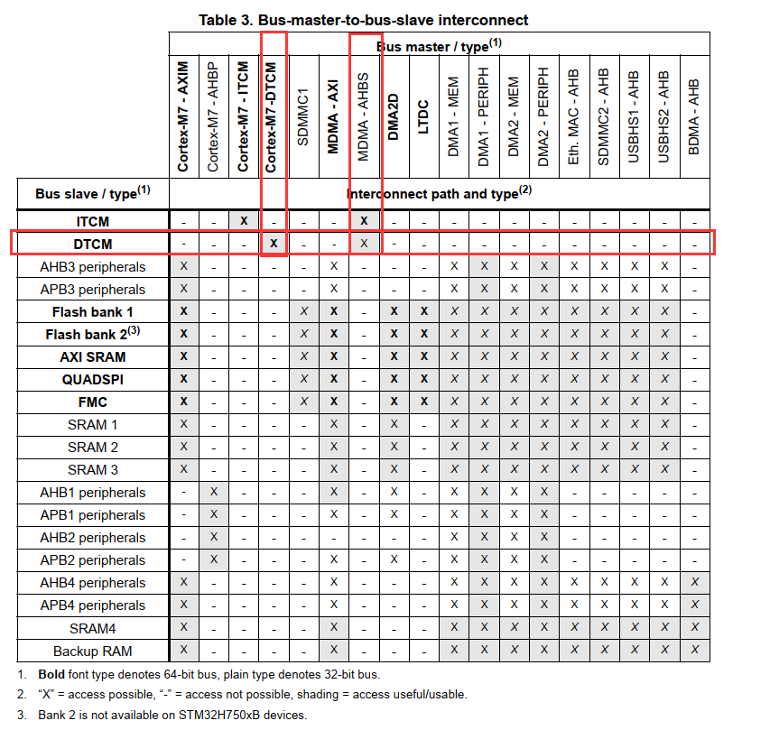
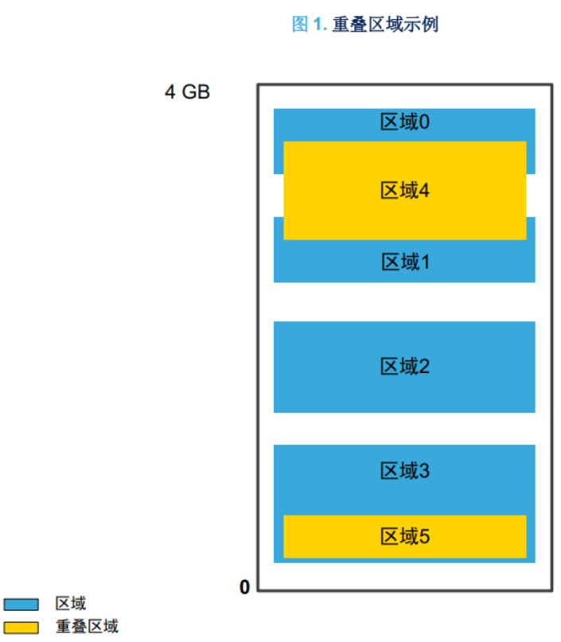
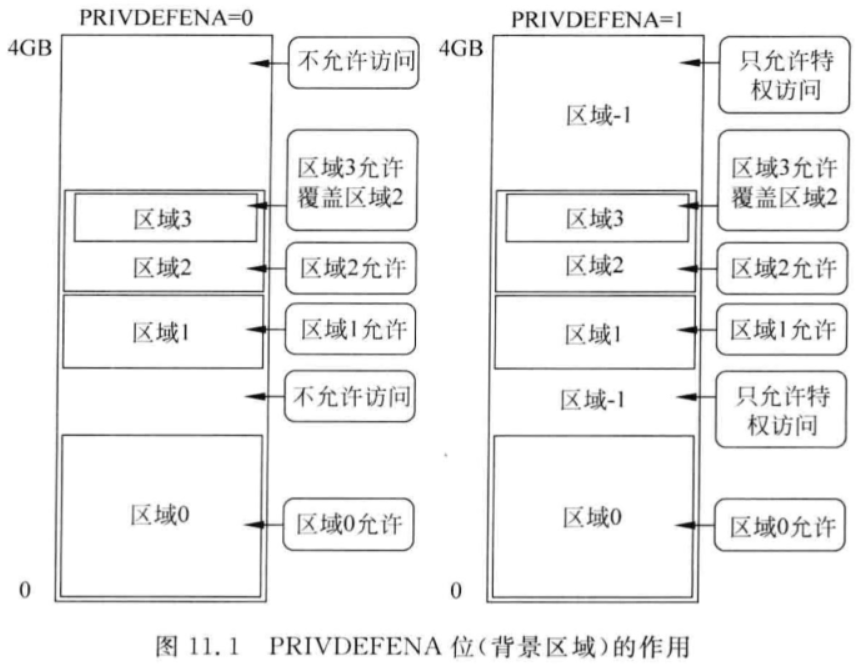
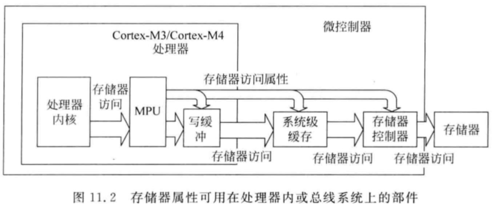
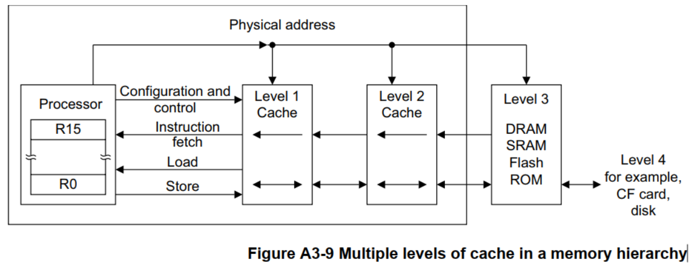
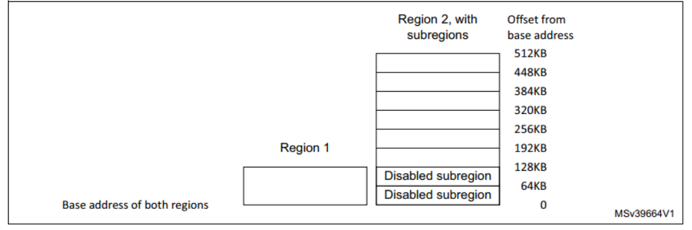
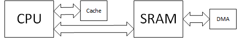
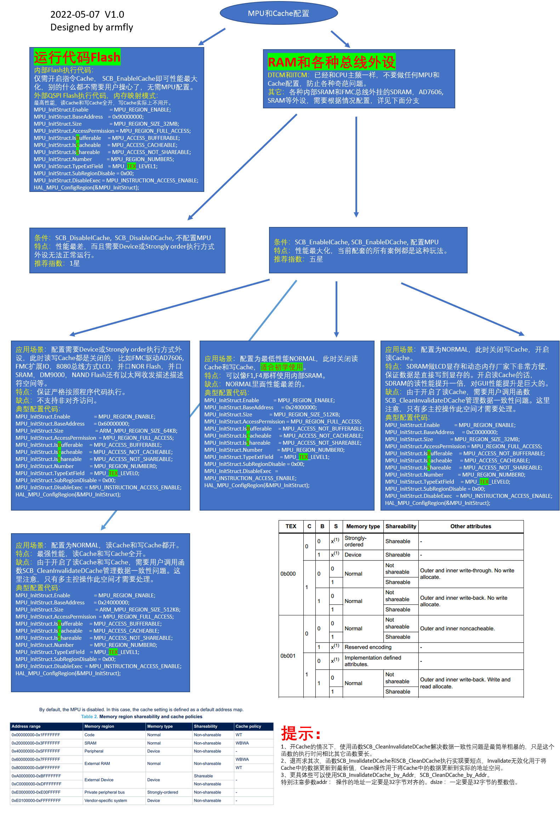

# 1 为什么要配置MPU

在默认的配置下，STM32H7优先使用128KB的**TCM（Tightly-Coupled Memory 紧密耦合内存，ITCM 用于指令，DTCM 用于数据，特点是跟内核速度一样，而片上 RAM 的速度基本都达不到这个速度）**。CPU读写TCM内存的速度是480M，所以一般优先使用128KB的DTCM。CPU直接读写其他静态内存的速度仅仅只有200M，会白白浪费CPU的480M主频了。为了解决这个问题，STM32H7有了L1-Cache。通过提前将数据缓冲到16KB的L1-Cache，然后CPU再从L1-Cache里读取数据，这样就能解决当CPU读写AXI SRAM与SRAM1等内存时所造成的性能损失。

比如，我们可以看到DTCM只与内核、MDMA相连，而我们外设采集的数据，只能送入AXI SRAM，SRAM1，SRAM2，SRAM3里。此时就需要使用MPU+L1-Cache的方式提高CPU读写AXI SRAM，SRAM1，SRAM2，SRAM3等内存的速度。

而为了正常使用L1-Cache缓存数据，**<u>必须设置MPU，Cache是通过MPU来配置的</u>**。

> 鉴于TCM是480MHz的，无论是默认设置还是实际选项都建议使用TCM作为主RAM，其他需要大RAM或DMA的场合，使用剩余的RAM空间。



# 2 MPU

MPU 可以使嵌入式系统更加稳健和安全：

- 避免应用任务破坏其他任务或 OS 内核使用的栈或数据存储器；
- 避免<u>**非特权任务**</u>访问对系统可靠性和安全性很重要的外设；
- 将 SRAM 或 RAM 空间定义为不可执行的（**永不执行，XN**），防止代码注入攻击；
- 利用 MPU 定义**其他存储器属性**，如可被输出到系统级缓存单元或存储器控制器的可缓存性（配合L1-Cache使用，以提升低速RAM的读写速度）。

> 简单的说就是内存保护、 外设保护和代码访问保护。  	——《安富莱_STM32-V7开发板_用户手册，含BSP驱动包设计（V3.5）.pdf》
>
> 以下很多内容也来自于上述手册，不再重复指出，赘述。

## 2.1 MPU的功能实现

在STM32H7中，MPU最多可以独立保护16个内存区域（受保护区域的确切数量可能因内核和器件而有所不同），每个区域最小要求为256个字节，每个区域又可以划分为8个子区域。由于子区域一般都相同大小，这样每个子区域的大小就是 32 字节，正好跟 L1-Cache 的 **Cache Line** 大小一样。

MPU 可以配置的 16 个内存区的序号范围是 0 到 15，还有默认区 default region，也叫作背景区，序号**-1**。由于这些内存区可以嵌套和重叠，所以这些区域在嵌套或者重叠的时候有个优先级的问题。序号15 的优先级最高，以此递减，**序号-1，即背景区的优先级最低**。这些优先级是固定的。  

> 在 Arm v8 架构（Cortex-M33）中，使用起始地址和终止地址来定义区域，使开发人员能够以灵活、简单的方式组织这些区域。此外， 正是区域大小的可灵活配置得到提升，故Cortex-M33就没有子区域的概念了。  
>
> **Cortex-M7是基于ARM v7架构的，因此还是有子区域的概念的，后续学习最好不要搞混。**

在下图的重叠区域示例中，区域 4 与区域 0 和 1 重叠，区域 5 完全包含在区域 3 内。因为优先级是递增的，所以重叠区域（橙色）优先。因此，如果区域 0 是可写的，而区域 4 不可写，那么位于区域 0 和区域 4 重叠部分的地址为不可写。

> **在 Armv8 架构（Cortex-M33）中，不允许区域重叠**，由于其 MPU 区域的定义更加灵活，因此也没有必要重叠MPU区域。 
>
> MPU 是统一的，意味着没有单独的区域用于数据和指令。  
>
> MPU 还可以用于定义其他存储器属性（如可缓存性），可以导出到系统级缓存单元或存储存控制器。 Arm 架构中的存储器属性设置可以支持两种级别的缓存：内部缓存和外部缓存。 STM32F7 和 STM32H7 系列仅支持一种级别的缓存（L1- Cache）。
>
> 缓存控制由缓存控制寄存器实现全局控制，但MPU可以指定缓存策略以及区域是否可缓存。




## 2.2 MPU可配置的内存类型

常见的内存类型有以下三种：

1. Normal memory

   允许 CPU 以有效方式安排字节、半字和字的加载和存储（编译器不了解存储器区域类型）。对于普通存储器区域， CPU 不一定按照程序中列出的顺序执行加载/存储操作。

2. Device memory

   在Device memory Region内，加载和存储是严格按照顺序进行的。这是为了确保以正确的顺序设置寄存器。  

3. Strongly ordered memory

   程序完全按照代码顺序执行，CPU 会等待加载/存储指令执行（有效的总线访问）结束，然后执行程序流中的下一条指令。这可能导致性能损失。

   > 如存放在QSPI中的程序（XIP），就需要以这种方式来运行。

下表显示了可能的MPU区域属性，包括了可共享性和缓存行为属性，这些属性通常仅在处理器配置了**缓存**时才相关。

<center><b>Memory Attributes Summary</b></center>

| Memory Type      | Shareability | Other attributes                                           | Description                                                  |
| ---------------- | ------------ | ---------------------------------------------------------- | ------------------------------------------------------------ |
| Strongly-ordered | -            | -                                                          | All accesses to Strongly-ordered memory occur in program order. <span style="background:#FFFFBB;">All Strongly-ordered regions are assumed to be shared.</span> |
| Device           | Shared       | -                                                          | Memory-mapped peripherals that several processors share.     |
| -                | Non-shared   | -                                                          | Memory-mapped peripherals that only a single processor uses. |
| Normal           | Shared       | Non-cacheable Write-through Cacheable Write-back Cacheable | Normal memory that is shared between several processors.     |
| -                | Non-shared   | Non-cacheable Write-through Cacheable Write-back Cacheable | Normal memory that only a single processor uses.             |

> 对于STM32H7来说，只具有单核，不应开启共享功能。
>
> 需要注意的是，**在Strongly-ordered和Device类型的内存下不支持非对齐访问。**也是我配的 QSPI 还是 Normal 类型的原因。

## 2.3 MPU相关的寄存器

| Address    | Name                                              | Type | Required Privilege | Reset Value | Description                                                  |
| ---------- | ------------------------------------------------- | ---- | ------------------ | ----------- | ------------------------------------------------------------ |
| 0xE000ED90 | MPU_TYPE                                          | RO   | Privileged         | 0x00001600  | 表示MPU是否存在，以及支持的区域数量                          |
| 0xE000ED94 | MPU_CTRL                                          | RW   | Privileged         | 0x00000000  | 使能MPU、背景区域，以及是否在hard fault、NMI和FAULTMASK escalated handlers中启用MPU |
| 0xE000ED98 | MPU_RNR                                           | RW   | Privileged         | Unknown     | 根据MPU_RBAR和MPU_RASR选择待配置的 MPU 区域                  |
| 0xE000ED9C | MPU_RBAR                                          | RW   | Privileged         | Unknown     | MPU 区域的基地址                                             |
| 0xE000EDA0 | <span style="background:#FF9999;">MPU_RASR</span> | RW   | Privileged         | -           | <span style="background:#FF9999;">MPU区域的属性和大小</span> |
| 0xE000EDA4 | MPU_RBAR_A1                                       | RW   | Privileged         | Unknown     | Alias of RBAR，别名寻址区域，在访问这些地址时，实际访问的是MPU->RBAR 或 MPU->RASR。之所以要有这些寄存器别名，是为了能一次性设置多个 MPU 区域，如使用多存储（STM）指令。 |
| 0xE000EDA8 | MPU_RASR_A1                                       | RW   | Privileged         | -           | Alias of RASR，别名寻址区域                                  |
| 0xE000EDAC | MPU_RBAR_A2                                       | RW   | Privileged         | Unknown     | Alias of RBAR                                                |
| 0xE000EDB0 | MPU_RASR_A2                                       | RW   | Privileged         | -           | Alias of RASR                                                |
| 0xE000EDB4 | MPU_RBAR_A3                                       | RW   | Privileged         | Unknown     | Alias of RBAR                                                |
| 0xE000EDB8 | MPU_RASR_A3                                       | RW   | Privileged         | -           | Alias of RASR                                                |

以下，逐一介绍。

### 2.3.1 MPU type register, MPU_TYPE

用于确定MPU是否存在，若 DREGION 域读出为0，则说明 MPU 不存在。

| Bits   | Name     | Type | Reset Value      | Description                                                  |
| ------ | -------- | ---- | ---------------- | ------------------------------------------------------------ |
| 23: 16 | IREGION  | RO   | 0                | 本 MPU 支持的指令区域数，由于 ARMv7-M 架构使用统一的 MPU，其总为0 |
| 15: 8  | DREGION  | RO   | 0x00, 0x08, 0x16 | MPU 支持的区域数<br>0x00: MPU不存在<br/>0x08: 8个MPU区域<br/>0x16: 16个MPU区域 |
| 0      | SEPARATE | RO   | 0                | 表示支持分立的指令和数据地址映射，ARM v7使用的是统一的MPU，其总为0 |

### 2.3.2 MPU control register, MPU_CTRL

复位后，该寄存器的数值为 0，表示 MPU 禁止，MPU_CTRL的作用主要有：

1. 使能MPU；
2. 使能默认的内存映射背景区域；
3. 在HardFault、NMI和FAULTMASK置1的处理函数中，使能MPU。

要使能 MPU，软件应该首先设置每个MPU 区域，然后再设置 MPU 控制寄存器的 ENABLE 位。通过将ENABLE设置为0来禁用MPU，意味着特权和非特权访问使用默认的内存映射。

| Bits | Name       | Type | Reset Value | Description                                                  |
| ---- | ---------- | ---- | ----------- | ------------------------------------------------------------ |
| 2    | PRIVDEFENA | RW   | 0           | PRIVDEFENA用于背景区域的使能，区域编号为-1，MPU中配置的所有内存区域的优先级都高于默认内存映射。<br>ENABLE位设置为1时：<br>0           禁用默认的内存映射，任何非定义区域的指令访问或数据获取会发生故障；<br>1           特权访问时，将默认内存映射作为背景区域，非特权访问则会被阻止。<br>ENABLE位设置为0时，处理器忽略PRIVDEFENA位。<br>如果没有使能任何一个区域，且PRIVDEFENA位和ENABLE位都设置为1，只有**特权代码**可以在系统地址映射中执行。 |
| 1    | HFNMIENA   | RW   | 0           | ENABLE位设置为1时，控制在执行低于0优先级的中断处理函数访问内存时，MPU是使能还是非使能。应用于**HardFault、NMI和FAULTMASK设置为1的异常处理函数**：<br/>0           MPU在这些处理函数中失能<br>1           在这些处理函数中，MPU使能 |
| 0    | ENABLE     | RW   | 0           | 使能MPU：<br>0           失能<br/>1           使能           |

当ENABLE和PRIVDEFENA都设置为1时：

1. 任何特权软件进行的访问，如果不寻址已启用的内存区域，其行为与默认内存映射定义的一致；
2. 任何非特权软件进行的访问，如果不寻址已启用的内存区域，将导致MemManage错误。

当ENABLE位设置为1，必须使能至少一个内存映射的区域，系统才可以运行，除非PRIVDEFENA位为0。

当ENABLE位设置为0时，系统使用默认的内存映射，具有与未设置MPU的内存区域相同的内存属性。默认内存映射适用于来自特权和非特权软件的访问。

可以参考下图：



> XN和Strongly-ordered规则总是适用于系统控制空间（System Control Space），不论ENABLE位是否置位。

当MPU启用时，始终允许访问系统控制空间（System Control Space）和向量表。内存区域的其他区域无论PRIVDEFENA是否设置为1都可以访问。

除非HFNMIENA设置为1，否则当处理器执行优先级为-1或-2的异常处理程序时，MPU不会启用。这些优先级的异常处理函数，仅在处理硬故障或NMI异常或使能FAULTMASK时才可能，将HFNMIENA位设置为1可在使用这两个优先级操作时启用MPU。

Thumb指令集中包括被特权软件执行，执行非特权内存访问的指令：

1. 执行非特权寄存器加载的指令：LDRBT、LDRHT、LDRSBT、LDRSHT、LDRT；
2. 执行非特权寄存器存储的指令：STRBT、STRHT、STRT。

下表展示了由HardFault或NMI的异常处理函数或FAULTMASK设置为1时的另一个异常处理函数发出时，HFNMIENA和ENABLE位对这些以上指令的处理，以及对其他特权软件的不同情况。

| HFNMIENA | ENABLE | Specified handlers<br>HardFault, NMI handler, 或其他FAULTMASK设置为1的异常处理函数 | Other privileged software |
| -------- | ------ | ------------------------------------------------------------ | ------------------------- |
| 0        | 0      | MPU失能，非特权访问，使用默认的内存映射                      |                           |
| 0        | 1      | MPU对这些处理函数失能，非特权访问，使用默认的内存映射        | 非特权访问，使用MPU       |
| 1        | 0      | 不可预测，软件一定不能使用这个配置                           |                           |
| 1        | 1      | MPU使能，非特权访问，使用MPU                                 |                           |

上表显示了MPU配置或默认内存映射定义了非特权加载或存储指令访问的地址的属性。指令访问属性的处理取决于这些属性。如果该属性不允许一个非特权访问，那么内存系统会产生一个错误。如果该访问有NMI、HardFault处理，或FAULTMASK设置为1导致的执行优先级为-1的情况，该错误会导致一个锁定（lockup）。

**设置 MPU 控制寄存器中的使能位通常是 MPU 设置代码的最后一步**，否则 MPU 可能会在区域配置完成前意外产生错误。许多情况下，特别是在具有动态 MPU 配置的嵌入式 OS中，MPU 配置程序开头应该将 MPU 禁止，以免在 MPU 区域配置期间意外触发 MemManage错误。

### 2.3.3 MPU region number register, MPU_RNR

MPU_RNR指定被MPU_RBAR和MPU_RASR引用的内存区域（0~15），通常来说，在访问MPU_RBAR和MPU_RASR前需要先MPU_RNR向写入对应的区域编号。然而，区域编号的值也可以通过将MPU_RBAR的VALID置一来改变，这可以更新REGION域内的值。

| Bits | Name   | Type | Reset Value | Description                                                |
| ---- | ------ | ---- | ----------- | ---------------------------------------------------------- |
| 7:0  | REGION | RW   | -           | 选择待编程的区域，MPU支持16个区域，该寄存器只是用bits[3:0] |

### 2.3.4 MPU region base address register, MPU_RBAR

MPU_RBAR定义了被MPU_RNR选择的MPU区域的基地址，可以更新MPU_RNR的值。

| Bits      | Name   | Type | Reset Value | Description                                                  |
| --------- | ------ | ---- | ----------- | ------------------------------------------------------------ |
| 31:N      | ADDR   | RW   | -           | 区域基地址域，N的值取决于域的大小                            |
| [(N-1):5] | -      | -    | -           | Reserved                                                     |
| 4         | VALID  | RW   | -           | 区域编号有效位：<br>0           MPU_RNR没有改变，处理器更新MPU_RNR中指定区域的基地址，忽略REGION字段的值<br>1           将MPU_RNR的值更新到REGION字段中区，更新REGION字段中指定的基地址<br>读出总为0，Always reads as zero |
| 3:0       | REGION | RW   | -           | 对于写的行为，见VALID字段的描述<br>对于读的行为，返回MPU_RNR指定的当前区域编号 |

#### 2.3.4.1 ADDR字段

MPU_RASR中SIZE 字段指定的区域大小定义了N的值：
$$
N=\log _2 \text { (Region size in bytes)}
$$
若区域的大小被设置为4 Gbytes，则MPU_RASR中没有有效的ADDR字段。在这种情况下，该区域占据了完整的内存映射，基地址为0x00000000。

**基地址与区域的大小对齐**，例如，64KB区域必须是以64KB的倍数对齐，例如，在0x00010000或0x00020000。

### 2.3.5 MPU region attribute and size register, MPU_RASR

MPU_RASR定义了区域大小和MPU_RNR指定的MPU区域的内存属性，以及使能该区域及其子区域。

MPU_RASR可以使用字访问方式进行访问：

1. 最高有效（The most significant）的半字包含区域属性；
2. 最低有效（The least significant）的半字包含区域的大小，区域及子区域的使能bits。

| Bits          | Name      | Type | Reset Value | Description                                                  |
| ------------- | --------- | ---- | ----------- | ------------------------------------------------------------ |
| 28            | XN        | RW   | 0           | 指令访问禁止位：<br>0           指令访问允许<br>1           指令访问禁止 |
| 26:24         | AP        | RW   | 0           | 访问允许字段                                                 |
| 21:19, 17, 16 | TEX, C, B | RW   | 0           | 内存访问属性                                                 |
| 18            | S         | RW   | 0           | 可共享位                                                     |
| 15:8          | SRD       | RW   | 0           | 字区域禁止使能字段，对于这个字段中的每一位：<br>0           对应的子区域使能<br>1           对应的子区域失能<br><strong style="color:#ff0000;">128字节和少于128字节的区域不支持子区域</strong>，写入这样的一个区域，SRD字段应设置为0x00<br>对于256字节的区域，每个子区域的大小是32字节，刚好是<strong style="color:#ff0000;">Cache Line</strong>的大小 |
| 5:1           | SIZE      | RW   | 0           | 指定MPU保护区域的大小，最小的值不能小于4（0b00100）          |
| 0             | ENABLE    | RW   | 0           | 区域使能位                                                   |

#### 2.3.5.1 SIZE字段的值

SIZE字段定义了MPU_RNR指定的MPU内存区域的大小：
$$
\text { (Region size in bytes) }=2^{(\mathrm{SIZE}+1)}
$$

可允许定义的最小区域为32 Bytes，对应的SIZE为4，下表给出的是一些示例。

| SIZE value   | Region size | Value of N | Note                   |
| ------------ | ----------- | ---------- | ---------------------- |
| 0b00100 (4)  | 32 Bytes    | 5          | Minimum permitted size |
| 0b01001 (9)  | 1 Kbyte     | 10         | -                      |
| 0b10011 (19) | 1 Mbyte     | 20         | -                      |
| 0b11101 (29) | 1 Gbyte     | 30         | -                      |
| 0b11111 (31) | 4 Gbytes    | 32         | Maximum possible size  |

#### 2.3.5.2 MPU 访问权限属性

访问权限相关的字节有RASR寄存器中的TEX，C，B，S，AP以及XN，控制对相关的内存区域的访问。如果在没有所需的权限下访问一个内存区域，那么MPU会产生一个权限错误。

TEX，C，B，S这些存储器属性在每次指令和数据访问时都会被输出到总线系统，而且该信息可被写缓冲或缓存单元等总线系统使用。





下表展示了TEX，C，B，S这些访问权限位的编码格式，**针对STM32H7来说，单核处理器，不需要用到Shareable的功能，甚至会降低其性能**。

<center><b>TEX, C, B, and S encoding</b></center>

| TEX   | C    | B    | S    | Memory type                        | Shareability  | Other attributes                                             |
| ----- | ---- | ---- | ---- | ---------------------------------- | ------------- | ------------------------------------------------------------ |
| 0b000 | 0    | 0    | X    | Strongly-ordered                   | Shareable     | -                                                            |
|       |      | 1    | X    | Device                             | Shareable     | -                                                            |
|       | 1    | 0    | 0    | Normal                             | Not shareable | Outer and inner <span style="background:#FFDBBB;">write-through. No write allocate.</span> |
|       |      |      | 1    |                                    | Shareable     |                                                              |
|       |      | 1    | 0    | Normal                             | Not shareable | Outer and inner <span style="background:#FFDBBB;">write-back. No write allocate.</span> |
|       |      |      | 1    |                                    | Shareable     |                                                              |
| 0b001 | 0    | 0    | 0    | Normal                             | Not shareable | Outer and inner <span style="background:#FFDBBB;">noncacheable.</span>> |
|       |      |      | 1    |                                    | Shareable     |                                                              |
|       |      | 1    | X    | Reserved encoding                  |               | -                                                            |
|       | 1    | 0    | X    | Implementation defined attributes. |               | -                                                            |
|       |      | 1    | 0    | Normal                             | Not shareable | Outer and inner <span style="background:#FFDBBB;">write-back. Write and read allocate.</span> |
|       |      |      | 1    |                                    | Shareable     |                                                              |
| 0b010 | 0    | 0    | X    | Device                             | Not shareable | <span style="background:#FFDBBB;">Nonshared Device.</span>   |
|       |      | 1    | X    | Reserved encoding                  |               | -                                                            |
|       | 1    | X    | X    | Reserved encoding                  |               | -                                                            |
| 0b1BB | A    | A    | 0    | Normal                             | Not shareable | <span style="background:#FFDBBB;">Cached memory, BB = outer policy, AA = inner policy</span>. See the following table for the encoding of the AA and BB bits. |
|       |      |      | 1    |                                    | Shareable     |                                                              |

<center><b>Cache policy for memory attribute encoding</b></center>

| Encoding, AA or BB | Corresponding cache policy          |
| ------------------ | ----------------------------------- |
| 00                 | Non-cacheable                       |
| 01                 | Write back, write and read allocate |
| 10                 | Write through, no write allocate    |
| 11                 | Write back, no write allocate       |

下表展示了AP字段定义特权和非特权软件访问权限的编码格式。

<center><b>AP encoding</b></center>

| AP[2:0] | Privileged permissions | Unprivileged permissions | Description                                                 |
| ------- | ---------------------- | ------------------------ | ----------------------------------------------------------- |
| 000     | No access              | No access                | All accesses generate a permission fault                    |
| 001     | RW                     | No access                | Access from privileged software only                        |
| 010     | RW                     | RO                       | Writes by unprivileged software generate a permission fault |
| 011     | RW                     | RW                       | Full access                                                 |
| 100     | Unpredictable          | Unpredictable            | Reserved                                                    |
| 101     | RO                     | No access                | Reads by privileged software only                           |
| 110     | RO                     | RO                       | Read only, by privileged or unprivileged software           |
| 111     | RO                     | RO                       | Read only, by privileged or unprivileged software           |

#### 2.3.5.3 XN（Execute Never的编码格式）

XN位提供了一个永不执行的能力。为了使处理器执行一条指令，该指令必须存储在一个具备以下特征的内存区域中：

- AP 位表明该区域对于特定的特权级别具有读取访问权限；
- XN位必须为0。

如果不满足以上条件，处理器在执行该指令时将会发生 MemManage 错误。

| XN   | Description                           |
| ---- | ------------------------------------- |
| 0    | 允许执行自该区域取指（fetch）的指令   |
| 1    | 不允许执行自该区域取指（fetch）的指令 |

#### 2.3.5.4 子区域与SRD

**256个字节或超过256个字节的区域可以划分成8个相等大小的子区域。**要禁用子区域，需要设置MPU_RASR中SRD字段中的相应位。SRD的最低有效位控制第一个子区域，最高有效位控制最后一个子区域。禁用一个子区域将导致另一个区域重叠到被禁用的范围内时才匹配。如果没有其他启用的区域与禁用的子区域重叠，并且访问是非特权模式或背景区域被禁用，则MPU发出一个错误。

**32、64和128字节的区域不支持子区域。对于这些大小的区域，用户必须将SRD字段设置为0x00，否则MPU的行为是不可预测的。**

以下是一个示例：

> 两个基地址相同的区域发生重叠，其中区域区域一的大小为128KB，区域二的大小为512KB。为确保区域一的属性应用于前128KB的区域，需设置区域二的SRD字段为0b00000011，以禁用前两个子区域，如图所示。



### 2.3.6 MPU alias register

MPU_RBAR和MPU_RASR的地址范围为0xE000ED9C-0xE000EDA3。在MPU_RBAR的0xE000ED9C的地址范围，Armv7-M内核的处理器设置了基于此地址的+8 Bytes，+16 Bytes，+24 Bytes偏移的别名。使用这些寄存器别名，结合MPU_RBAR.REGION字段和MPU_RBAR.VALID字段设置为1，软件可以使用一系列字写入有效地更新高达四个区域，前提是所有访问的区域都在区域0到区域15的范围内。

### 2.3.7 MPU匹配错误

当内存访问违反了MPU权限，处理器会产生一个MemManage错误。MemManage错误状态寄存器表示报警产生的原因。

### 2.3.8 MPU设计技巧

1. 为避免意外的行为，在更新中断处理程序可能访问的区域的属性之前，**需要禁用中断**。
2. **处理器不支持对 MPU 寄存器进行非对齐访问**。MPU 寄存器仅支持对齐的字访问，而对字节和半字的访问是不可预测的。
3. 在设置 MPU 时，如果之前已经对 MPU 进行了编程，需先禁用未使用的区域，以防止之前的区域设置影响新的 MPU 设置。

### 2.3.9 更新一个MPU区域

要更新MPU区域的属性，需要更新MPU_RNR、MPU_RBAR和MPU_RASR寄存器。可以单独编程每个寄存器，也可以使用多字编程同时编程所有这些寄存器。使用MPU_RBAR和MPU_RASR的别名，通过STM指令可以同时编程多达四个区域。

#### 2.3.9.1 使用单独的字更新MPU区域

代码示例如下：

```assembly
; R1 = region number
; R2 = size/enable
; R3 = attributes
; R4 = address
LDR R0,=MPU_RNR ; 0xE000ED98, MPU region number register
STR R1, [R0, #0x0] ; Region Number
STR R4, [R0, #0x4] ; Region Base Address
STRH R2, [R0, #0x8] ; Region Size and Enable
STRH R3, [R0, #0xA] ; Region Attribute
```

如果要更改的区域已使能，需要在新的区域设置写入MPU前禁用该区域，代码示例如下：

```assembly
; R1 = region number
; R2 = size/enable
; R3 = attributes
; R4 = address
LDR R0,=MPU_RNR ; 0xE000ED98, MPU region number register
STR R1, [R0, #0x0] ; Region Number
BIC R2, R2, #1 ; Disable
STRH R2, [R0, #0x8] ; Region Size and Enable
STR R4, [R0, #0x4] ; Region Base Address
STRH R3, [R0, #0xA] ; Region Attribute
ORR R2, #1 ; Enable
STRH R2, [R0, #0x8] ; Region Size and Enable
```

软件必须使用内存屏障指令的情况：

1. 如果存在未完成的内存传输（例如缓冲写入），可能会受到MPU设置更改的影响，则在MPU设置之前需要使用内存屏障指令。
2. MPU设置后，如果包括必须新的MPU设置的内存传输，则必须使用内存屏蔽指令。

在MPU设置期间，软件不需要任何的内存屏蔽指令，因为软件通过Strongly-ordered的内存区域PPB（the Private Peripheral Bus）访问MPU。

比如，如果需要在编程序列之后立即生效所有内存访问行为，则使用DSB指令和ISB指令。在更改MPU设置时，例如在上下文切换的末尾，需要DSB。如果使用分支或调用进入编程MPU区域的代码，则需要ISB。如果通过发生异常进入编程序列，并通过从异常返回退出编程序列，则不需要ISB指令。

#### 2.3.9.2 使用多个字更新MPU区域

用户可以使用多个字直接编程，这取决于信息被划分得当。可以参考以下的示例：

```assembly
; R1 = region number
; R2 = address
; R3 = size, attributes in one
LDR R0, =MPU_RNR ; 0xE000ED98, MPU region number register
STR R1, [R0, #0x0] ; Region Number
STR R2, [R0, #0x4] ; Region Base Address
STR R3, [R0, #0x8] ; Region Attribute, Size and Enable
```

可以使用一个STM指令来优化以上代码：

```assembly
; R1 = region number
; R2 = address
; R3 = size, attributes in one
LDR R0, =MPU_RNR ; 0xE000ED98, MPU region number register
STM R0, {R1-R3} ; Region Number, address, attribute, size and enable
```

用户可以使用预打包信息来进行两个字的操作。这意味着MPU_RBAR所需的区域编号，并且VALID位设置为1。如果数据是静态打包的，可以在BootLoader中使用以下代码：

```assembly
; R1 = address and region number in one
; R2 = size and attributes in one
LDR R0, =MPU_RBAR ; 0xE000ED9C, MPU Region Base register.
STR R1, [R0, #0x0] ; Region base address and region number combined
; with VALID (bit 4) set to 1.
STR R2, [R0, #0x4] ; Region Attribute, Size and Enable.
```

# 3 Cache

Cache是包含地址信息（通常称为标记）和相关数据的高速内存块。其目的是提高内存访问的平均速度。Cache遵循两个局部性原则：

1. 空间局部性：对一个位置的访问很可能会跟随对相邻位置的访问，例如顺序执行指令或使用数据结构。
2. 时间局部性：在短时间内，对内存区域的访问很可能会被重复执行，例如，代码循环执行。 

为了最小化存储的控制信息数量，Cache使用空间局部性原则将多个位置组合在同一个标记下。这个逻辑块通常称为Cache Line。当数据加载到Cache 中后，随后的加载和存储的访问时间将减少，从而带来整体性能提升。对于已经在缓存中的信息的访问称为缓存命中，而其他访问称为缓存未命中。

通常情况下，Cache 是自动管理的，更新自动发生。每当处理器想要访问可Cache 的位置时，都会检查Cache 。如果访问是Cache 命中（hit），则立即发生访问，否则分配一个位置并从内存中加载Cache Line。不同的缓存拓扑和访问策略是可能的，但是它们必须符合底层体系结构的内存一致性模型。

Cache 引入了许多潜在的问题，主要是由于：

1. 内存访问发生的时间与程序员通常期望的时间不同。
2. 存在多个物理位置可以保存数据项。

STM32H7的D-Cache和I-Cache都是16 KB，I-Cache无需用户管理，D-Cache的作用主要是帮助CPU加速访问SRAM，如果CPU每次读写SRAM中的数据，都可以在D-Cache中进行，那么就可以完整地利用480 MHz的主频，但实际上由于D-Cache只有16 KB，总是存在用完的时候。

对于使能Cache的SRAM，要分为两种情况考虑：

1. 读操作：如果 CPU 要读取的 SRAM 区数据在 Cache 中已经加载好，这就叫读命中（Cache hit），如果 Cache里面没有怎么办，这就是所谓的读 Cache Miss。  
2. 写操作：如果 CPU 要写的 SRAM 区数据在 Cache 中已经开辟了对应的区域（Cache Line，以 32字节为单位），这就叫写命中（Cache hit），如果 Cache 里面没有开辟对应的区域怎么办，这就是所谓的写 Cache Miss。




以下为几个需要认识的关键知识点：

1. Cortex-M7 内核的 L1-Cache 由多行内存区组成，每行有 32 字节，每行都配有一个地址标签。数据缓冲 D-Cache 是每 4 行为一组，称为 4-way set associative。而指令缓冲区 I-Cache 是 2 行为一组，这样节省地址标签，不用每个行都标记一个地址。

2. 对于读操作，只有在第 1 次访问指定地址时才会加载到 Cache，而写操作的话，可以直接写到内存中（write-through 模式）或者放到 Cache 里面，后面再写入（write-back 模式）。
3. 如果采用的是 Write back， Cache line 会被标为 dirty，等到此行被 evicted 时，才会执行实际的写操作，将 Cache Line 里面的数据写入到相应的存储区。
4. Cache 命中是访问的地址落在了给定的 Cache Line 里面，所以硬件需要做少量的地址比较工作，以检查此地址是否被缓存。如果命中了，将用于缓存读操作或者写操作。如果没有命中，则分配和标记新行，填充新的读写操作。如果所有行都分配完毕了， Cache 控制器将支持 eviction 操作。根据 Cache Line 替换算法，一行将被清除 Clean，无效化 Invalid 或者重新配置。数据缓存和指令缓存是采用的伪随机替换算法。
5. Cache 支持的 4 种基本操作，使能，禁止，清空和无效化。 Clean 清空操作是将 Cache Line 中标记为 dirty 的数据写入到内存里面，而无效化 Invalid 是将 Cache Line 标记为无效，即删除操作。

## 3.1 支持的Cache配置

对表格`TEX, C, B, and S encoding`做简化，我们主要需要考虑的只有着两种TEX配置方式。TEX 是用来设置 Cache 策略的， C 是 Cache使能， B 是缓冲使能，用来配合 Cache 设置，而 S 是共享使能，用来解决多总线或者多核访问时的同步问题，**对STM32H750XB来说，无需关注**。 MPU 配置的时候，最主要的也是配置这几个参数。

<center><b>TEX, C, B, and S encoding</b></center>

| TEX   | C    | B    | S    | Memory type                        | Shareability  | Other attributes                                             |
| ----- | ---- | ---- | ---- | ---------------------------------- | ------------- | ------------------------------------------------------------ |
| 0b000 | 0    | 0    | X    | Strongly-ordered                   | Shareable     | -                                                            |
|       |      | 1    | X    | Device                             | Shareable     | -                                                            |
|       | 1    | 0    | 0    | Normal                             | Not shareable | Outer and inner <span style="background:#FFDBBB;">write-through. No write allocate.</span> |
|       |      |      | 1    |                                    | Shareable     |                                                              |
|       |      | 1    | 0    | Normal                             | Not shareable | Outer and inner <span style="background:#FFDBBB;">write-back. No write allocate.</span> |
|       |      |      | 1    |                                    | Shareable     |                                                              |
| 0b001 | 0    | 0    | 0    | Normal                             | Not shareable | Outer and inner <span style="background:#FFDBBB;">non-cacheable.</span> |
|       |      |      | 1    |                                    | Shareable     |                                                              |
|       |      | 1    | X    | Reserved encoding                  |               | -                                                            |
|       | 1    | 0    | X    | Implementation defined attributes. |               | -                                                            |
|       |      | 1    | 0    | Normal                             | Not shareable | Outer and inner <span style="background:#FFDBBB;">write-back. Write and read allocate.</span> |
|       |      |      | 1    |                                    | Shareable     |                                                              |

Cache 支持的策略有如下四种：

| Corresponding cache policy          | 描述                                                         |
| ----------------------------------- | ------------------------------------------------------------ |
| Non-cacheable                       | 不使用Cache                                                  |
| Write back, write and read allocate | **写入策略**：如果cache命中，则只写入cache，不再写入到对应的内存区域；如果未命中，则开辟对应的cache，并同时向cache和对应的内存区域写入。 <br />**读取策略**：如果cache命中，则直接从cache中读取，不再读取对应的内存区域，如果cache未命中，则开辟对应的cache区域，并从对应的内存区域中将数据同步至cache，并读取cache。 |
| Write through, no write allocate    | **写入策略**：如果cache命中，则同时向cache和对应的内存区域中写入；如果未命中，则只写入对应的内存区域，不开辟新的cache。<br />**读取策略**：如果cache命中，则直接从cache中读取，不再读取对应的内存区域，如果cache未命中，则开辟对应的cache区域，并从对应的内存区域中将数据同步至cache，并读取cache。 |
| Write back, no write allocate       | **写入策略**：如果cache命中，则只写入cache，不再写入到对应的内存区域；如果未命中，则只写入对应的内存区域，不开辟新的cache。 <br />**读取策略**：如果cache命中，则直接从cache中读取，不再读取对应的内存区域，如果cache未命中，则开辟对应的cache区域，并从对应的内存区域中将数据同步至cache，并读取cache。 |

## 3.2 四种Cache配置

### 3.2.1 Non-cacheable

正常的读写操作，无 Cache。

对应四种 MPU 配置如下：

| TEX   | C    | B    | S                           |
| ----- | ---- | ---- | --------------------------- |
| 0b000 | 0    | 0    | X（忽略此位，强制为共享  ） |
|       |      | 1    | X（忽略此位，强制为共享  ） |
| 0b001 | 0    | 0    | 0                           |
|       |      |      | 1                           |

### 3.2.2 Write back, write and read allocate

> **M7 内核只要开启了 Cache， read allocate 就是开启的，因此以下两种模式的读操作也是一样的。**

对应两种 MPU 配置如下：

| TEX   | C    | B    | S    |
| ----- | ---- | ---- | ---- |
| 0b001 | 1    | 1    | 1    |
|       |      | 1    | 0    |

#### 3.2.2.1 使能了此配置的 SRAM 缓冲区写操作

如果 CPU 要写的 SRAM 区数据，在 Cache 中已经开辟了对应的区域，那么会写到 Cache 里面，而不会立即更新 SRAM；**如果没有，就使用 write allocate** ，意思就是 CPU 写到 SRAM 里面的数据，会同步在 Cache 里面开辟一个空间将写入 SRAM 中的数据加载进来，如果此时立即读此 SRAM 区，那么就会有很大的速度优势。

安全隐患，如果 Cache 命中的情况下，此时仅 Cache 更新了，而 SRAM 没有更新，那么 DMA 直接从 SRAM 里面读出来的就是错误的。

#### 3.2.2.2 使能了此配置的 SRAM 缓冲区读操作

如果 CPU 要读取的 SRAM 区数据在 Cache 中已经加载好，就可以直接从 Cache 里面读取。如果没有，就用到配置 read allocate 了，意思就是在 Cache 里面开辟区域，将 SRAM 区数据加载进来，后续的操作， CPU 可以直接从 Cache 里面读取，从而时间加速。

安全隐患，如果 Cache 命中的情况下， DMA 写操作也更新了 SRAM 区的数据， CPU 直接从 Cache里面读取的数据就是错误的。

**这个配置可以最大程度发挥 Cache 性能，不过具体应用仍需具体分析。**

### 3.2.3 Write through, read allocate, no write allocate

> **M7 内核只要开启了 Cache， read allocate 就是开启的。**

对应两种 MPU 配置如下：

| TEX   | C    | B    | S    |
| ----- | ---- | ---- | ---- |
| 0b000 | 1    | 0    | 1    |
|       |      | 0    | 0    |

#### 3.2.2.1 使能了此配置的 SRAM 缓冲区写操作

如果 CPU 要写的 SRAM 区数据，在 Cache 中已经开辟了对应的区域，那么会写到 Cache和SRAM 里面；**如果没有，就使用 no write allocate  ** ，意思就是 CPU 写到 SRAM 里面的数据，不需要在Cache中开辟空间。

在写 Cache 命中的情况下，这个方式的优点是 Cache 和 SRAM 的数据同步更新时，没有多总线访问造成的数据一致性问题。缺点也明显， Cache 在写操作上无法有效发挥性能。

#### 3.2.2.2 使能了此配置的 SRAM 缓冲区读操作

如果 CPU 要读取的 SRAM 区数据在 Cache 中已经加载好，就可以直接从 Cache 里面读取。如果没有，就用到配置 read allocate 了，意思就是在 Cache 里面开辟区域，将 SRAM 区数据加载进来，后续的操作， CPU 可以直接从 Cache 里面读取，从而时间加速。

安全隐患，如果 Cache 命中的情况下， DMA 写操作也更新了 SRAM 区的数据， CPU 直接从 Cache里面读取的数据就是错误的。

**这个配置可以最大程度发挥 Cache 性能，不过具体应用仍需具体分析。**

### 3.2.4 Write back, read allocate, no write allocate

> **M7 内核只要开启了 Cache， read allocate 就是开启的。**

对应两种 MPU 配置如下：

| TEX   | C    | B    | S    |
| ----- | ---- | ---- | ---- |
| 0b000 | 1    | 1    | 1    |
|       |      | 1    | 0    |

#### 3.2.2.1 使能了此配置的 SRAM 缓冲区写操作

如果 CPU 要写的 SRAM 区数据，在 Cache 中已经开辟了对应的区域，那么会写到 Cache里面，不会立即更新SRAM；**如果没有，就使用 no write allocate  ** ，意思就是 CPU 写到 SRAM 里面的数据，不需要在Cache中开辟空间。

安全隐患，如果 Cache 命中的情况下，此时仅 Cache 更新了，而 SRAM 没有更新，那么 DMA 直接从 SRAM 里面读出来的就是错误的。

#### 3.2.2.2 使能了此配置的 SRAM 缓冲区读操作

如果 CPU 要读取的 SRAM 区数据在 Cache 中已经加载好，就可以直接从 Cache 里面读取。如果没有，就用到配置 read allocate 了，意思就是在 Cache 里面开辟区域，将 SRAM 区数据加载进来，后续的操作， CPU 可以直接从 Cache 里面读取，从而时间加速。

安全隐患，如果 Cache 命中的情况下， DMA 写操作也更新了 SRAM 区的数据， CPU 直接从 Cache里面读取的数据就是错误的。

**这个配置可以最大程度发挥 Cache 性能，不过具体应用仍需具体分析。**

## 3.3 Shareable Config

参考Memory Attributes Summary，《pm0253-stm32f7-series-and-stm32h7-series-cortexm7-processor-programming-manual-stmicroelectronics》中对其的描述是多核共享。

而在《an4838-managing-memory-protection-unit-in-stm32-mcus-stmicroelectronics》中，有以下描述：

> The S field is for a shareable memory region: the memory system provides data synchronization between bus masters in a system with multiple bus masters, for example, a processor with a DMA controller. A strongly-ordered memory is always shareable. If multiple bus masters can access a non-shareable memoryregion, the software must ensure the data coherency between the bus masters. **The STM32F7 series andSTM32H7 series do not support hardware coherency. The S field is equivalent to non-cacheable memory.**

具体意思，即在STM32F7和STM32H7系列中，**不支持硬件一致性，开始S字段（使能共享）等同于关闭Cache**。

实际测试下面四种开 Cache 的情况，**开关共享对缓冲区的大批量数据的读操作影响很大**，基本差出两倍，而写操作基本没有影响，也许这就是所谓的多总线同步读造成的。另外共享开关仅对开启了 Cache 的情况下有影响，而对于关闭了 Cache 的情况是没有影响的，开不开没关系。

## 3.4 推荐的方法

1. 推荐使用 128KB 的 TCM 作为主 RAM 区，其它的专门用于大缓冲和 DMA 操作等。  
2. Cache 问题主要是 CPU 和 DMA 都操作这个缓冲区时容易出现，使用时要注意。  
3. Cache 配置的选择，**优先考虑的是 WB，然后是 WT 和关闭 Cache**，其中 WB 和 WT 的使用中可以配合 ARM 提供的函数解决上面说到的隐患问题 ，但不是万能的，在不起作用的时候，直接暴力选择函数 **SCB_CleanInvlaidateDCache** 解决。关于这个问题，在分别配置以太网MAC 的描述符缓冲区，发送缓冲区和接收缓冲区时尤其突出。

# 4 初始化函数解析

```c
MPU_Region_InitTypeDef MPU_InitStruct;

/* 禁止 MPU */
HAL_MPU_Disable();

/* 配置AXI SRAM的MPU属性为Write back, Read allocate，Write allocate */
MPU_InitStruct.Number           = MPU_REGION_NUMBER0;
MPU_InitStruct.Enable           = MPU_REGION_ENABLE;
MPU_InitStruct.BaseAddress      = 0x24000000;
MPU_InitStruct.Size             = MPU_REGION_SIZE_512KB;
MPU_InitStruct.AccessPermission = MPU_REGION_FULL_ACCESS;
MPU_InitSruct.IsBufferable      = MPU_ACCESS_BUFFERABLE;
MPU_InitStruct.IsCacheable      = MPU_ACCESS_CACHEABLE;
MPU_InitStruct.IsShareable      = MPU_ACCESS_NOT_SHAREABLE;
MPU_InitStruct.TypeExtField     = MPU_TEX_LEVEL1;
MPU_InitStruct.SubRegionDisable = 0x00;
MPU_InitStruct.DisableExec      = MPU_INSTRUCTION_ACCESS_ENABLE;

HAL_MPU_ConfigRegion(&MPU_InitStruct);

/*使能 MPU */
HAL_MPU_Enable(MPU_PRIVILEGED_DEFAULT);
```

## 4.1 全局配置

第一行的`MPU_Region_InitTypeDef`是配置结构体，用来存储MPU配置参数。不多做解释。

在配置MPU之前需要调用`HAL_MPU_Disable`函数来临时禁用MPU，配置结束后则需要调用`HAL_MPU_Enable`函数重新使能。

使能MPU的函数 `HAL_MPU_Enable` 需要一个参数，该参数对应的是MPU的控制策略，共有如下可选项：

- `MPU_HFNMI_PRIVDEF_NONE` 此选项下，默认区域（default region）不允许访问，并且在硬故障，NMI和FAULTMASK处理程序期间**禁用**MPU。
- `MPU_HARDFAULT_NMI` 默认区域（default region）不允许访问，并且在硬故障，NMI和FAULTMASK处理程序期间**启用**MPU。
- `MPU_PRIVILEGED_DEFAULT` 默认区域（default region）仅允许特权访问，并且在硬故障，NMI和FAULTMASK处理程序期间**禁用**MPU。
- `MPU_HFNMI_PRIVDEF` 默认区域（default region）仅允许特权访问，并且在硬故障，NMI和FAULTMASK处理程序期间**启用**MPU。

默认区域（default region）的概念将在下文解释

MPU针对区域的具体配置的参数共有11个。以下是对这些参数进行详细的解析。

## 4.2 Number参数

**代码：**

```
MPU_InitStruct.Number = MPU_REGION_NUMBER0
```

**作用：设定当前配置的保护区域编号。此处配置的是0号区域。**

MPU总共有16个可以独立配置的内存保护区域（在CM4内核的MCU中是8个），范围从0~15。对应的参数就是`MPU_REGION_NUMBER0`到`MPU_REGION_NUMBER15`。注意，这些区域编号顺序和其保护的内存区域的顺序无关。也就是说，完全可以配置1号区域为`0x24000000~0x24080000`，而2号区域用来保护`0x00000000~0x00010000`。
MPU保护的区域可以重叠。在发生重叠的时候，优先应用高序号的MPU配置。也就是，序号更大的MPU区域优先级更高。
除了0~15这16个保护区域外，还有一个编号为-1的内存保护区域，其称之为`默认区域（default region)`或`背景区域（background region）`。其优先级为最低。`默认区域`的访问策略由启用MPU的函数`HAL_MPU_Enable`的参数指定。

## 4.3 Enable参数

```
MPU_InitStruct.Enable = MPU_REGION_ENABLE
```

**作用：此参数用来决定此区域的MPU配置是否启用。**

可选项为`MPU_REGION_ENABLE`（启用）和`MPU_REGION_DISABLE`（禁用），

## 4.4 BaseAddress参数、Size参数

```
MPU_InitStruct.BaseAddress = 0x24000000
MPU_InitStruct.Size = MPU_REGION_SIZE_512KB
```

**作用：此参数用来确定内存保护区域的具体范围**

这两个参数在一起确定了内存区域的范围。其中BaseAddress是保护区域的起始地址。Size则是区域的大小。内存区域的起始地址必须对齐到设定的大小。比如将`Size`设定为1M，那么`BaseAddress`就必去对齐到1M。即 `BaseAddress % Size == 0` 。此外，Size是不能随意设置的，只能从 `MPU_REGION_SIZE_xxx`的宏中进行选取

## 4.5 AccessPermission参数

`MPU_InitStruct.AccessPermission = MPU_REGION_FULL_ACCESS` 

**作用：配置此区域的内存访问（读写）权限**

## 4.6 IsBufferable、IsCacheable、IsShareable、TypeExtField参数

```
 MPU_InitStruct.IsBufferable = MPU_ACCESS_BUFFERABLE;
 MPU_InitStruct.IsCacheable = MPU_ACCESS_CACHEABLE;
 MPU_InitStruct.IsShareable = MPU_ACCESS_NOT_SHAREABLE;
 MPU_InitStruct.TypeExtField = MPU_TEX_LEVEL1;
```

**这几个参数组合起来共同决定了所配置的内存区域的缓存和共享策略，是相当重要的参数。**

其中参数的具体定义为：

- `IsShareable`：设定配置的内存区域是否可以共享，可设置为1：`MPU_ACCESS_BUFFERABLE`和0：`MPU_ACCESS_NOT_BUFFERABLE`。这个参数在多用在总线和多核访问时的访问控制，一般情况下，除非使用STM32H745/H747，否则基本不用在乎此参数。
- `IsCacheable`：设定cache策略，可设置为1：`MPU_ACCESS_CACHEABLE`和0：`MPU_ACCESS_NOT_CACHEABLE`
- `IsBufferable`：设定Buffer策略，可设置为1：`MPU_ACCESS_BUFFERABLE`和0：`MPU_ACCESS_NOT_BUFFERABLE`
- `TypeExtField`：设定MPU的TEX Level，可设置为：`MPU_TEX_LEVEL0`、`MPU_TEX_LEVEL1`和`MPU_TEX_LEVEL2`。其中，`MPU_TEX_LEVEL2`实际应用不到，所以可以认为只有前两个值可以设定

## 4.7 SubRegionDisable参数

```
MPU_InitStruct.SubRegionDisable = 0x00;
```

配置是否禁用对应的`Sub Region`子区域。

## 4.8 DisableExec参数

```
MPU_InitStruct.DisableExec = MPU_INSTRUCTION_ACCESS_ENABLE;
```

**这个参数用来控制当前区域中的指令（代码）是否可以执行。**

可用的选项为`MPU_INSTRUCTION_ACCESS_ENABLE`和`MPU_INSTRUCTION_ACCESS_DISABLE`

# 5 配置示例

以下为《STM32F7 Series and STM32H7 Series Cortex®-M7 processor programming manual》中**上电后默认的MPU属性**：

<center><b>Memory region shareability and cache policies</b></center>

| Address range          | Memory region          | Memory type       | Shareability  | Cache policy |
| ---------------------- | ---------------------- | ----------------- | ------------- | ------------ |
| 0x00000000- 0x1FFFFFFF | Code                   | Normal            | Non-shareable | WT           |
| 0x20000000- 0x3FFFFFFF | SRAM                   | Normal            | Non-shareable | WBWA         |
| 0x40000000- 0x5FFFFFFF | Peripheral             | Device            | Non-shareable | -            |
| 0x60000000- 0x7FFFFFFF | External RAM           | Normal            | Non-shareable | -            |
| 0x80000000- 0x9FFFFFFF |                        |                   |               | WT           |
| 0xA0000000- 0xBFFFFFFF | External device        | Device            | Shareable     | -            |
| 0xC0000000- 0xDFFFFFFF |                        |                   | Non-shareable | -            |
| 0xE0000000- 0xE00FFFFF | Private Peripheral Bus | Strongly- ordered | Shareable     | -            |
| 0xE0100000- 0xFFFFFFFF | Vendor-specific device | Device            | Non-shareable | -            |

> WT = Write through, no write allocate. WBWA = Write back, write allocate  

以下为《RM0433 Reference manual：STM32H742, STM32H743/753 and STM32H750 Value line advanced Arm®-based 32-bit MCUs》中的**上电后默认的MPU属性**：

<center><b>Memory map and default device memory area attributes</b></center>

| egion             | Boundary address        | Arm® Cortex®-M7                                          | Type   | Attributes                                 | Execute never |
| ----------------- | ----------------------- | -------------------------------------------------------- | ------ | ------------------------------------------ | ------------- |
| External Devices  | 0xD0000000 -0xDFFFFFFF  | FMC SDRAM Bank2 (or Reserved in case of FMC remap)       | Device | -                                          | Yes           |
|                   | 0xCC000000-0xCFFFFFFF   | FMC SDRAM Bank1 (or remap of FMC NOR/PSRAM/SRAM 4 Bank1) |        |                                            |               |
|                   | 0xC8000000 - 0xCBFFFFFF | FMC SDRAM Bank1 (or remap of FMC NOR/PSRAM/SRAM 3 Bank1) |        |                                            |               |
|                   | 0xC4000000 - 0xC7FFFFFF | FMC SDRAM Bank1 (or remap of FMC NOR/PSRAM/SRAM 2 Bank1) |        |                                            |               |
|                   | 0xC0000000 - 0xC3FFFFFF | FMC SDRAM Bank1 (or remap of FMC NOR/PSRAM/SRAM 1 Bank1) |        |                                            |               |
|                   | 0xA0000000 - 0xBFFFFFFF | Reserved                                                 |        |                                            |               |
| External Memories | 0x90000000 -0x9FFFFFFF  | QUADSPI                                                  | Normal | Write-through cache attribute              | No            |
|                   | 0x80000000 - 0x8FFFFFFF | FMC NAND Flash memory                                    |        |                                            |               |
|                   | 0x70000000 -0x7FFFFFFF  | Reserved (or remap of FMC SDRAM Bank2)                   | Normal | Write-back, write allocate cache attribute | No            |
|                   | 0x6C000000 - 0x6FFFFFFF | FMC NOR/PSRAM/SRAM 4 Bank1 (or remap of FMC SDRAM Bank1) |        |                                            |               |
|                   | 0x68000000 - 0x6BFFFFFF | FMC NOR/PSRAM/SRAM 3 Bank1 (or remap of FMC SDRAM Bank1) |        |                                            |               |
|                   | 0x64000000 - 0x67FFFFFF | FMC NOR/PSRAM/SRAM 2 Bank1 (or remap of FMC SDRAM Bank1) |        |                                            |               |
|                   | 0x60000000 - 0x63FFFFFF | FMC NOR/PSRAM/SRAM 1 Bank1 (or remap of FMC SDRAM Bank1) |        |                                            |               |
| Peripherals       | 0x40000000 -0x5FFFFFFF  | Peripherals                                              | Device | -                                          | Yes           |
| RAM               | 0x38801000 -0x3FFFFFFF  | Reserved                                                 | Normal | Write-back, write allocate cache attribute | No            |
|                   | 0x38800000 -0x38800FFF  | Backup SRAM                                              |        |                                            |               |
|                   | 0x38010000 -0x387FFFFF  | Reserved                                                 |        |                                            |               |
|                   | 0x38000000 -0x3800FFFF  | SRAM4                                                    |        |                                            |               |
|                   | 0x30048000 -0x37FFFFFF  | Reserved                                                 |        |                                            |               |
|                   | 0x30040000 -0x30047FFF  | SRAM3                                                    |        |                                            |               |
|                   | 0x30020000 -0x3003FFFF  | SRAM2                                                    |        |                                            |               |
|                   | 0x30000000 -0x3001FFFF  | SRAM1                                                    |        |                                            |               |
|                   | 0x24080000 -0x2FFFFFFF  | Reserved                                                 |        |                                            |               |
|                   | 0x24000000 -0x2407FFFF  | AXI SRAM                                                 |        |                                            |               |
|                   | 0x20020000 -0x23FFFFFF  | Reserved                                                 |        |                                            |               |
|                   | 0x20000000 -0x2001FFFF  | DTCM                                                     |        |                                            |               |
| Code              | 0x1FF20000 -0x1FFFFFFF  | Reserved                                                 | Normal | Write-through cache attribute              | No            |
|                   | 0x1FF00000 -0x1FF1FFFF  | System Memory                                            |        |                                            |               |
|                   | 0x08200000 -0x1FEFFFFF  | Reserved                                                 |        |                                            |               |
|                   | 0x08100000 -0x081FFFFF  | Flash memory bank 2                                      |        |                                            |               |
|                   | 0x08000000 -0x080FFFFF  | Flash memory bank 1                                      |        |                                            |               |
|                   | 0x00010000 -0x07FFFFFF  | Reserved                                                 |        |                                            |               |
|                   | 0x00000000 -0x0000FFFF  | ITCM                                                     |        |                                            |               |

从以上两张表格给出的内存组织中，可以看到，**上电后默认的MPU属性**中：

1. 对应内存区域的Memory Type和对应的Cache Attributes；
2. 默认配置下，无需对内部Flash做额外的配置操作。


具体的配置方式可以参考安富莱给出的这张图：



# 6 数据一致性问题

当CPU和DMA同时进行读写操作时，需要注意数据一致性问题，可以通过调用`SCB_CleanInvalidDcache();`来解决。

后面碰到更新··········

# 7 参考文献

an4838-managing-memory-protection-unit-in-stm32-mcus-stmicroelectronics

ARMv7-M Architecture Reference Manual

pm0253-stm32f7-series-and-stm32h7-series-cortexm7-processor-programming-manual-stmicroelectronics

RM0433 Reference manual：STM32H742, STM32H743753 and STM32H750 Value line advanced Arm®-based 32-bit MCUs

STM32F7 Series and STM32H7 Series Cortex®-M7 processor programming manual

ARM Cortex-M3与Cortex-M4权威指南（中文版）

理解与应用 MPU的特权与用户模式

[Cache Memory Tutorial. What is a Cache Memory. Why Cache Memories are Needed. How does Cache Memories Work (vlsiip.com)](http://www.vlsiip.com/cache/index.html)

[STM32H7/M7中的MPU（内存保护单元）配置详解 - 嘉立创EDA开源硬件平台 (oshwhub.com)](https://oshwhub.com/article/STM32H7-M7zhong-de-MPU-nei-cun-bao-hu-dan-yuan-pei-zhi-yang-xie)

[第14期BSP驱动教程：超干货，MPU和Cache实战，一张图了解所有经典配置案例，争取人人都可以玩溜_哔哩哔哩_bilibili](https://www.bilibili.com/video/BV1p54y1f7CY/?spm_id_from=333.788&vd_source=b2294685dcc4b104a99f116c1c175bce)