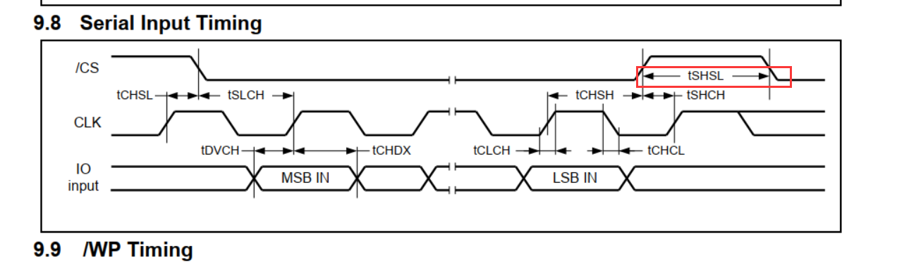

# 1 引脚配置

以 W25Q256JV 为例。

使能 QuadSPI 并修改引脚配置，此处采用的是 `Bank1 with Quad SPI Lines` 的配置。

| 对应接口        | IO   |
| --------------- | ---- |
| QUADSPI_CLK     | PB2  |
| QUADSPI_BK1_NCS | PG6  |
| QUADSPI_BK1_IO0 | PF8  |
| QUADSPI_BK1_IO1 | PF9  |
| QUADSPI_BK1_IO2 | PF7  |
| QUADSPI_BK1_IO3 | PF6  |

需要注意的是，QuadSPI 的速度较快，而 STM32CubeMX 对 QuadSPI 的默认引脚配置 **Maximum output speed** 为 **Low**，需要修改为 **Very High**。

# 2 时钟配置

QuadSPI 使用的 240MHz 的频率。

此处最好选择 **HCLK3** ，否则在 XIP 应用中，可能会导致程序卡死。

# 3 参数配置

1. W25Q256JV 的最高单线频率是133MHz，QuadSPI 使用的 240MHz 的频率，因此 **Clock Prescaler** 选的是1，也就是除以 2，= 120MHz；
2. **Fifo Threshold** 仅用于间接模式，直接最大，不影响；
3. **Flash Size** = log~2~（Flash字节数） - 1 =  log~2~（2^25^） - 1 = 24；
4. **Chip Select High Time**：定义 CS 片选到发送至 Flash 的命令之间至少保持的高电平时钟周期 **ChipSelectHighTime+1**，这个参数需要参考 **tSHSL**，经计算这个参数 **≥ 6** 是比较合适的；

5. **Clock Mode**，W25QXX设置为这两种模式均可：
   - MODE0：表示片选信号空闲期间， CLK 时钟信号是低电平
   - MODE3：表示片选信号空闲期间， CLK 时钟信号是高电平
6. **Flash ID**：Quad SPI 有两个 BANK，这里使用的 BANK1；
7. **Dual Flash**：此处只使用BANK1，禁止双BANK。

# 4 MPU 配置

无需写，只需要读。

TEX = 1, C = 1, B = 1, S = 0, Memory Type 为 Write Back。

> 注：QSPI 的内存映射地址默认为 0x90000000。