# 0 前置知识

FMC 连接好外部的存储器并初始化后，就可以直接通过访问地址来读写数据，这种地址访问与 I2C EEPROM、SPI FLASH 的不一样， 后两种方式都需要控制 I2C 或 SPI 总线给存储器发送地址，然后获取数据；在程序里，这个地址和数据都需要分开使用不同的变量存储，并且访问时还需要使用代码控制发送读写命令。 而使用 FMC 外接存储器时，其**存储单元是直接映射到 STM32 的内部寻址空间的；在程序里，定义一个指向这些地址的指针， 然后就可以通过指针直接修改该存储单元的内容，FMC外设会自动完成数据访问过程，读写命令之类的操作不需要程序控制。** 

在 STM32H750 的数据手册中，FMC 把 SDRAM 的存储区域分成了 Bank1 和 Bank2 两块，这里的 Bank 与 SDRAM 芯片内部的 Bank 是不一样的概念，只是 FMC 的地址区域划分而已。每个 Bank 有不一样的起始地址， 且有独立的 FMC_SDCR 控制寄存器和 FMC_SDTR 时序寄存器， 还有独立的 FMC_SDCKE 时钟使能信号线和 FMC_SDCLK 信号线。

1. FMC_SDCKE0 和 FMC_SDCLK0 对应的存储区域1的地址范围是 0xC000 0000 - 0xCFFF FFFF；
2. FMC_SDCKE1和 FMC_SDCLK1 对应的存储区域2的地址范围是 0xD000 0000 - 0xDFFFFFFF。

当程序里控制内核访问这些地址的存储空间时， FMC 外设会即会产生对应的时序，对它外接的 SDRAM 芯片进行读写。

此处使用的地址线为 **A0~A12**，片选接口为 **FMC_SDNE1** 和 **FMC_SDCKE2**，因此参考以下各表，我们可以确定 SDRAM 的映射地址为 **0xD0000000**。

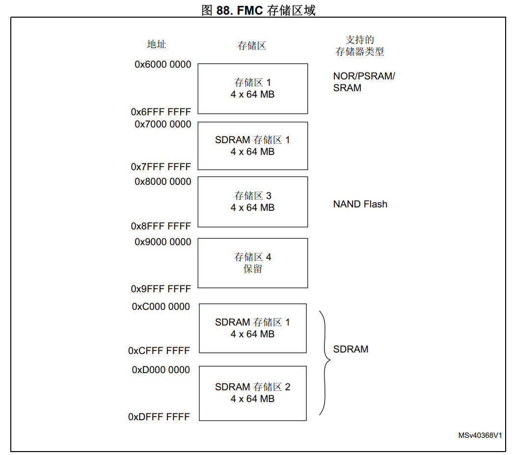

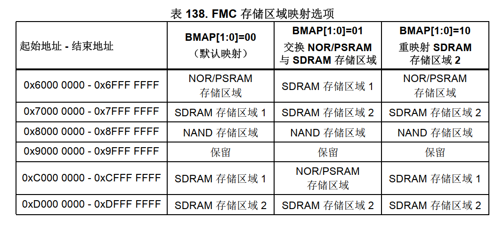


# 1 引脚配置

此处采用的是双片 SDRAM W9825G6KH-6 组成 32 位 SDRAM 的配置。

默认的 IO 配置未必与实际设计一直，需要自行设置，此处按下表设置。

| 对应接口   | IO   |
| ---------- | ---- |
| FMC_D1     | PD15 |
| FMC_D2     | PD0  |
| FMC_D3     | PD1  |
| FMC_D4     | PE7  |
| FMC_D5     | PE8  |
| FMC_D6     | PE9  |
| FMC_D7     | PE10 |
| FMC_D8     | PE11 |
| FMC_D9     | PE12 |
| FMC_D10    | PE13 |
| FMC_D11    | PE14 |
| FMC_D12    | PE15 |
| FMC_D13    | PD8  |
| FMC_D14    | PD9  |
| FMC_D15    | PD10 |
| FMC_D16    | PH8  |
| FMC_D17    | PH9  |
| FMC_D18    | PH10 |
| FMC_D19    | PH11 |
| FMC_D20    | PH12 |
| FMC_D21    | PH13 |
| FMC_D22    | PH14 |
| FMC_D23    | PH15 |
| FMC_D24    | PI0  |
| FMC_D25    | PI1  |
| FMC_D26    | PI2  |
| FMC_D27    | PI3  |
| FMC_D28    | PI6  |
| FMC_D29    | PI7  |
| FMC_D30    | PI9  |
| FMC_D31    | PI10 |
| FMC_A0     | PF0  |
| FMC_A1     | PF1  |
| FMC_A2     | PF2  |
| FMC_A3     | PF3  |
| FMC_A4     | PF4  |
| FMC_A5     | PF5  |
| FMC_A6     | PF12 |
| FMC_A7     | PF13 |
| FMC_A8     | PF14 |
| FMC_A9     | PF15 |
| FMC_A10    | PG0  |
| FMC_A11    | PG1  |
| FMC_A12    | PG2  |
| FMC_BA0    | PG4  |
| FMC_BA1    | PG5  |
| FMC_NBL0   | PE0  |
| FMC_NBL1   | PE1  |
| FMC_NBL2   | PI4  |
| FMC_NBL3   | PI5  |
| FMC_SDNE1  | PH6  |
| FMC_SDCKE1 | PH7  |
| FMC_SDNCAS | PG15 |
| FMC_SDNRAS | PF11 |
| FMC_SDNWE  | PC0  |
| FMC_SDCLK  | PG8  |

## 2 时钟配置

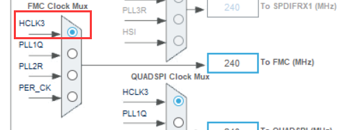

此处最好选择 **HCLK3** ，否则在 Bootloader 初始化 FMC ，App 直接使用的应用中，可能会导致程序卡死。

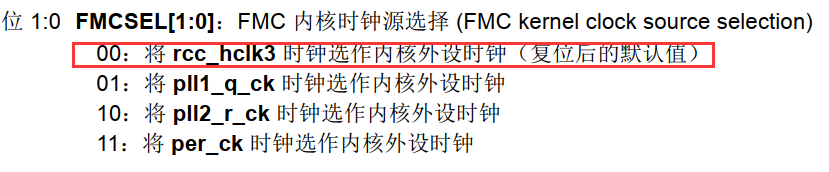

# 3 参数配置

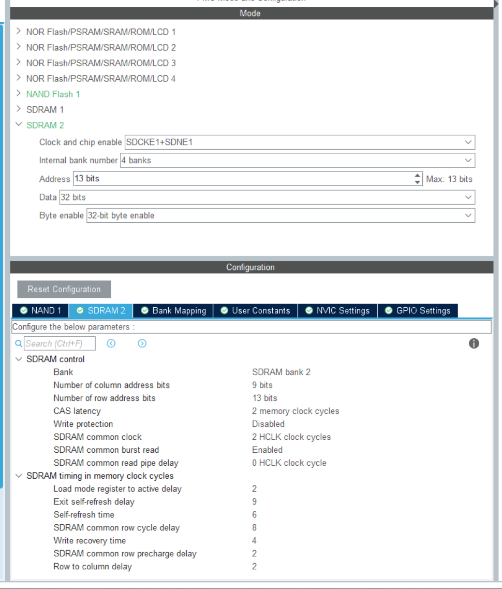

1. **Clock and chip enable**：根据引脚配置；
2. **Internal bank numbers**：W9825G6KH 内部有 4个 Bank，此处需要注意，使用的是 2个 W9825G6KH 组成 32 位的 SDRAM，此处能访问的 Bank 仍是 4 个；
3. **Address**：设置 13 位的地址线，W9825G6KH 有 13 位行地址和 9 位列地址；
4. **Data**：设置 32 位的数据总线宽度；
5. **Byte Enable**：是否使能数据掩码，这里设置使能。

**SDRAM control：**

1. **Bank**：由于采用的是 **FMC_SDNE1** 和 **FMC_SDCKE2**，对应 FMC-BANK2；
2. **Number of column address bits**：W9825G6KH 有 9 位列地址；
3. **Number of row address bits**：W9825G6KH 有 13 位行地址；
4. **CAS latency**：指列**地址选通延迟**，简称 CL，在发出读命令 (命令同时包含列地址) 后，需要等待几个时钟周期数据线 Data 才会输出有效数据，根据数据手册来看，W9825G6KH 支持 2 个 CAS Latency 或 3 个CAS Latency；
5. **Write protection**：**设置是否使能写保护模式**，通常是禁止；
6. **SDRAM common clock**：设置 FMC 与外部 SDRAM 通讯时的时钟频率，**只**可以设置成 STM32的 HCLK 时钟频率的 1/2、1/3 或禁止输出时钟 (**异步RAM不需要时钟**)，此处设置为2分频，就是1/2，SDRAM的时钟就是 $120MHz$；
7. **SDRAM common burst read**：设置是否使能突发读取模式，禁止时等效于 **BL=1**，使能时 BL 的值等于**模式寄存器**中的配置；
8. **SDRAM common read pipe delay**：配置在 CAS Latency 地址选通延迟后，再等待多少个 HCLK 时钟周期才进行数据采样，在确保正确的前提下，这个值设置为越短越好，可选择设置的参数值为 0、 1 或 2 个 HCLK 时钟周期。

**SDRAM timing in memory clock cycles：**

FMC 时钟是 $240MHz$，驱动 SDRAM 做了 2 分频，也就是 $120MHz$，一个 SDRAM 时钟周期就是 $\frac{25}{3}  ns$，以下参数的单位都是  $\frac{25}{3}  ns$。

查看下表，可知， 2 个 CAS Latency 时， SDRAM 的 $t_{ck}$ 最小值为 $7.5ns$。

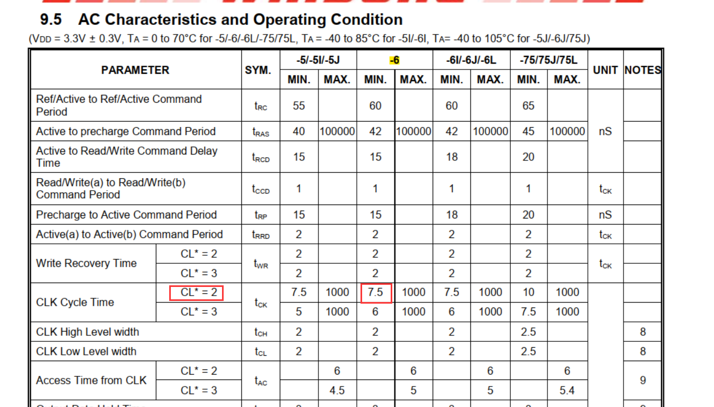

1. **Load mode register to active delay**：**tRSC** 定义加载模式寄存器的命令与激活命令或刷新命令之间的延迟，最小值为 $2t_{ck}$ ，也即 $15ns$，因此此参数设置为 $2$。

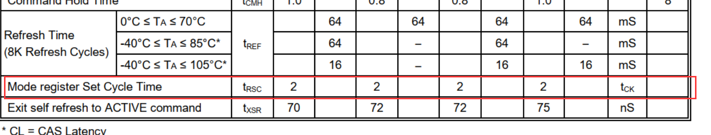

2. **Exit Self-Refresh Delay**：**tXSR** 定义从发出自刷新命令到发出激活命令之间的延迟，也即 $72ns$，因此此参数设置为 $9$。

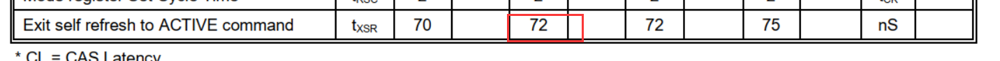

3. **Self-Refresh Time**：**tRAS** 定义最短的自刷新周期，也即 $42ns$，因此此参数设置为 $6$。

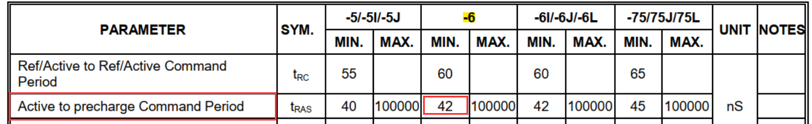

4. **Row Cycle Delay**：**tRC** 定义刷新命令和激活命令之间的延迟，也即 $60ns$，因此此参数设置为 $8$。

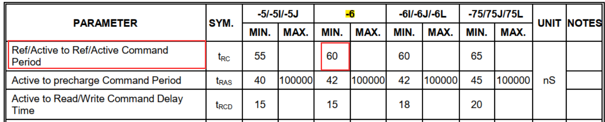

## 3.5 Write Recovery Time(TWR)

5. **Write Recovery Time**：**tWR** 定义在写命令和预充电命令之间的延迟，最小值为 $2t_{ck}$ ，也即 $15ns$，因此此参数设置为 $2$。

> 但实际使用中发现，此参数与其他参数有关，为保证稳定性，实际此参数设置为 4。
>
> ```
> Specifies the delay between a Write and a Precharge command in number of memory clock cycles. WriteRecoveryTime must satisfy the following constraints: 
> 1: WriteRecoveryTime >= SelfRefreshTime - RowToColumnDelay, 
> 2: WriteRecoveryTime >= RowCycleDelay - RowToColumnDelay - RowPrechargeDelay. 
> If two SDRAM devices are used, the FMC_SDTR1 and FMC_SDTR2 registers must be programmed with the same Write Recovery Time corresponding to the slowest SDRAM device.
> ```

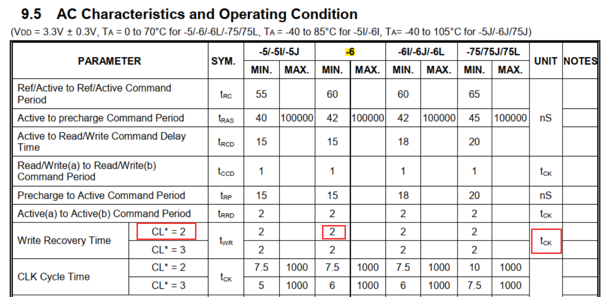

6. **RP Delay**：**tRP** 定义预充电命令与其它命令之间的延迟，也即 $15ns$，因此此参数设置为 $2$。

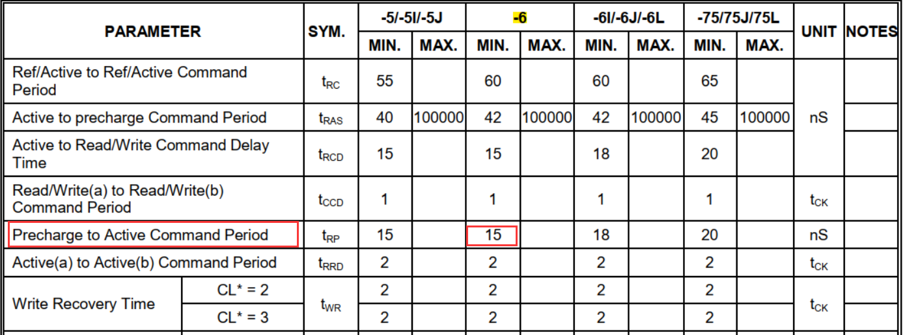

7. **RCD Delay**：**tRCD** 定义激活命令与读/写命令之间的延迟，也即 $15ns$。因此此参数设置为  $2$。

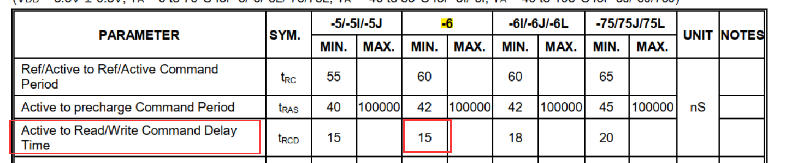

# 4 初始化序列设置

SDRAM 上电后，必须进行初始化，初始化序列设置可以参考以下命令的 Truth Table：

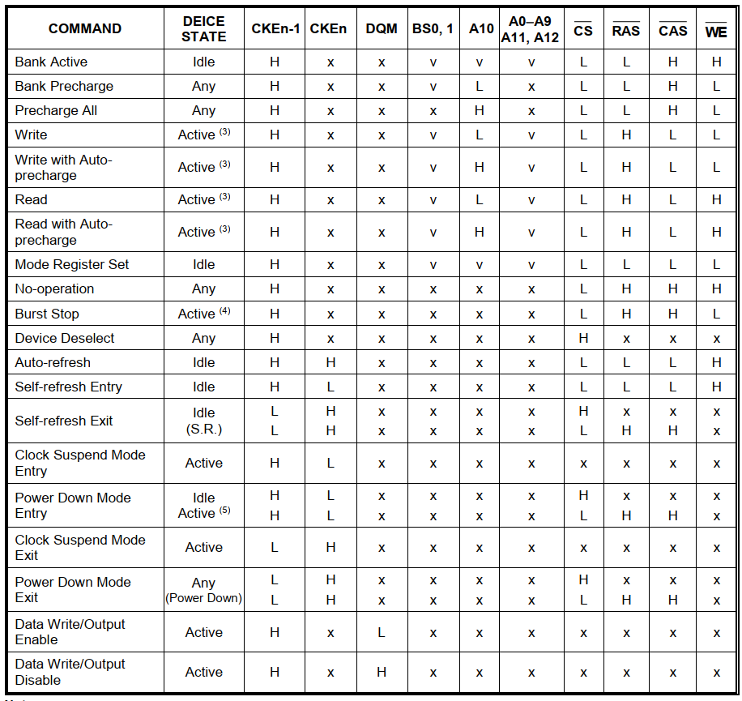

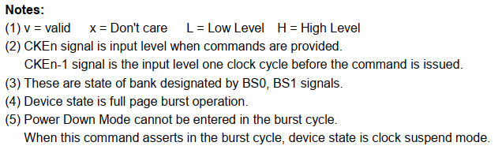

SDRAM 的初始化序列配置主要参考以下内容：

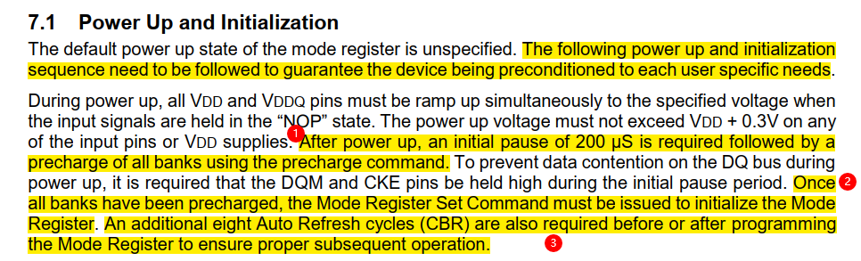

主要代码如下：

```c
/** @defgroup W9825G6KH_Exported_Functions W9825G6KH Exported Functions
  * @{
  */
/**
  * @brief  Initializes the W9825G6KH SDRAm memory
  * @param  hsdram: Component object pointer
  * @param  target : FMC_SDRAM_CMD_TARGET_BANK1 or FMC_SDRAM_CMD_TARGET_BANK2 or FMC_SDRAM_CMD_TARGET_BANK1_2
  * @retval error status
  */
int w9825g6kh_init_sequence(SDRAM_HandleTypeDef *hsdram, uint32_t target)
{
	uint32_t tmpmode = 0;

    /* Step 1: Configure a clock configuration enable command */
    if(w9825g6kh_enable_clock(hsdram, target) != HAL_OK)		return -HAL_ERROR;
    
	/* Step 2: Insert 100 us minimum delay */
	/* Inserted delay is equal to 1 ms due to systick time base unit (ms) */
	(void)HAL_Delay(1);

	/* Step 3: Configure a PALL (precharge all) command */
	if(w9825g6kh_precharge_all(hsdram, target) != HAL_OK)	return -HAL_ERROR;
        
	/* Step 4: Configure a Refresh command */
	if(w9825g6kh_config_refresh_mode(hsdram, target, FMC_SDRAM_CMD_AUTOREFRESH_MODE) != HAL_OK)	return -HAL_ERROR;
            
	/* Step 5: Program the external memory mode register */
	tmpmode = (uint32_t)SDRAM_MODEREG_BURST_LENGTH_2 |
             SDRAM_MODEREG_BURST_TYPE_SEQUENTIAL   |
             SDRAM_MODEREG_CAS_LATENCY_2           |
             SDRAM_MODEREG_OPERATING_MODE_STANDARD |
             SDRAM_MODEREG_WRITEBURST_MODE_SINGLE;
	if(w9825g6kh_config_load_mode_reg(hsdram, target, tmpmode) != HAL_OK)	return -HAL_ERROR;

	/* Step 6: Set the refresh rate counter 
	 * SDRAM refresh period / Number of rows）*SDRAM时钟速度 – 20
	 *	  	= 64ms / 8192 *120MHz - 20
	 *  	= 917.5 取值918
	 */
	if(HAL_SDRAM_ProgramRefreshRate(hsdram, 918) != HAL_OK)	return -HAL_ERROR;

    return HAL_OK;
}
```

`Command_Mode` 定义如下：

```c
/** @defgroup FMC_SDRAM_Command_Mode FMC SDRAM Command Mode
  * @{
  */
#define FMC_SDRAM_CMD_NORMAL_MODE               (0x00000000U)
#define FMC_SDRAM_CMD_CLK_ENABLE                (0x00000001U)
#define FMC_SDRAM_CMD_PALL                      (0x00000002U)
#define FMC_SDRAM_CMD_AUTOREFRESH_MODE          (0x00000003U)
#define FMC_SDRAM_CMD_LOAD_MODE                 (0x00000004U)
#define FMC_SDRAM_CMD_SELFREFRESH_MODE          (0x00000005U)
#define FMC_SDRAM_CMD_POWERDOWN_MODE            (0x00000006U)
/**
  * @}
  */
```

1. 发送时钟使能命令；

2. 插入延迟，这个延迟是必不可少的，此处根据数据手册可以选择 $\ge 200\mu s$；

3. 发送整个 SDRAM 预充电命令（FMC_SDRAM_CMD_PALL）；

4. 发送自刷新命令（FMC_SDRAM_CMD_AUTOREFRESH_MODE）；

5. 配置 SDRAM 模式寄存器（FMC_SDRAM_CMD_LOAD_MODE），主要配置参数如下：

   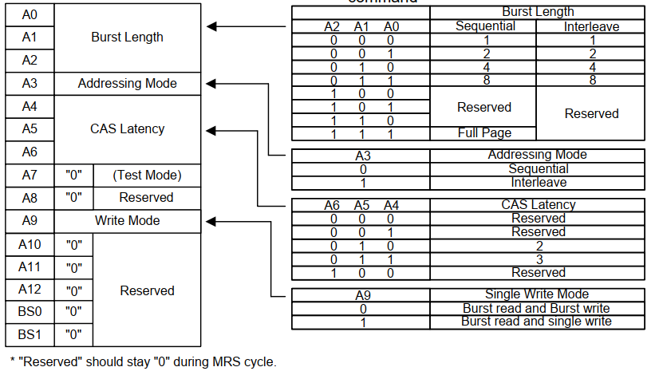

   - **Burst Length：** Burst Length译为突发长度，下面简称BL。突发是指在同一行中相邻的存储单元连续进行数据传输的方式，**连续传输所涉及到存储单元（列)的数量就是突发长度。**

     读/写操作，都是一次对一个存储单元进行寻址，如果要连续读/写就还要对当前存储单元的下一个单元进行寻址， 也就是要不断的发送列地址与读/写命令（行地址不变，所以不用再对行寻址）。虽然由于读/写延迟相同可以让数据的传输在 I/O端是连续的， 但它占用了大量的内存控制资源，在数据进行连续传输时无法输入新的命令，效率很低。

     为此，人们开发了**突发传输技术**，只要指定**起始列地址与突发长度**，内存就会依次地自动对后面相应数量的存储单元进行读/写操作，而不再需要控制器连续地提供列地址。 这样，除了第一笔数据的传输需要若干个周期外，其后每个数据只需一个周期的即可获得。其实我们**在EERPOM及FLASH读写的按页写入就是突发写入， 而它们的读取过程都是突发性质的**。

     **非突发连续读取模式：**不采用突发传输而是依次单独寻址，此时可等效于 BL=1。虽然也可以让数据连续地传输，但每次都要发送列地址与命令信息， 控制资源占用极大。

     突发连续读取模式：只要指定起始列地址与突发长度，寻址与数据的读取自动进行， 而只要控制好两段突发读取命令的间隔周期(与 BL相同)即可做到连续的突发传输。 而BL 的数值，也是不能随便设或在数据进行传输前临时决定。 在初始化SDRAM调用LOAD MODE REGISTER命令时就被固定。BL可用的选项是 1、2、4、8，常见的设定是 4 和8。若传输时实际需要数据长度小于设定的BL值， 则调用“突发停止”(BURSTTERMINATE)命令结束传输。

   - **BT（Addressing Mode）：**模式寄存器中的 BT 位用于设置突发模式，突发模式分为顺序(Sequential)与间隔(Interleaved)两种。在顺序方式中，操作按地址的顺序连续执行， 如果是间隔模式，则操作地址是跳跃的。跳跃访问的方式比较乱，不太符合思维习惯，我们一般用顺序模式。顺序访问模式时按照“0-1-2-3-4-5-6-7”的地址序列访问。

   - **CAS Latency：**模式寄存器中的 CASLatency 是指列地址选通延迟，简称 CL。在发出读命令(命令同时包含列地址)后，需要等待几个时钟周期数据线 DQ 才会输出有效数据， 这之间的时钟周期就是指 CL，CL 一般可以设置为 2 或 3 个时钟周期，见下图。

     CL 只是针对读命令时的数据延时，在写命令是不需要这个延时的，发出写命令时可同时发送要写入的数据。

     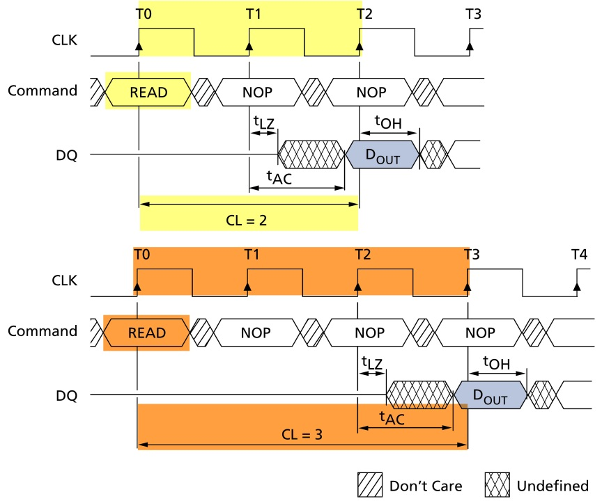

     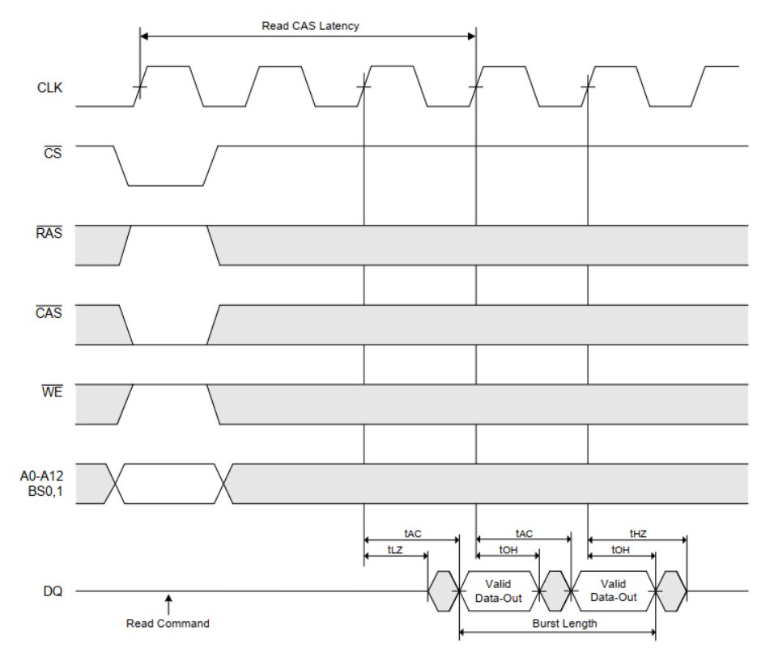

   - **Operating Mode：**SDRAM的工作模式。当它被配置为“0”的时候表示工作在正常模式，其它值是测试模式或被保留的设定。实际使用时必须配置成正常模式。

   - **Write Mode（WB）：**WB用于配置写操作的突发特性，可选择使用BL设置的突发长度或非突发模式。

6. 配置 SDRAM 的刷新率，这个计数值每个 SDCLK 周期自动减 1，减至 0 时，FMC 会自动向 SDRAM 发出自动刷新命令，控制 SDRAM 刷新，SDRAM每次收到刷新命令后，刷新一行， 对同一行进行刷新操作的时间间隔称为 SDRAM 的刷新周期。 目前公认的标准是 SDRAM 中电容保存数据的上限是 **64ms**， 也就是说每一行刷新的循环周期是 **64ms**。这样刷新速度就是： $行数量{\div}64ms$ 。 我们在看内存规格时，经常会看到 $4096 Refresh Cycles{\div}64ms$ 或 $8192 Refresh Cycles{\div}64ms$ 的标识，这里的 $4096$ 与 $8192$ 就代表这个芯片中每个 **L-Bank 的行数**。刷新命令一次对一行有效，发送间隔也是随总行数而变化，$4096$ 行时为 $15.625\mu s$， $8192$ 行时就为 $7.8125\mu s$。

此处 使用的是 W9825G6KH-6，自刷新规格为 $8192 Refresh Cycles{\div}64ms$，刷新一行需要 $7.8125\mu s$。
$$
Refresh Speed = \left (  Count + 1\right ) \times SDRAM Clock
$$

$$
Count = \left ( SDRAM Refresh Period {\div} Columns \right )\times SDRAM Clock - 20
$$

因此$REFRESH\_COUNT = \left ( 64ms{\div} 8192 \right ) \times 100MHz - 20 = 761.25$，取 $762$ 不会有影响。

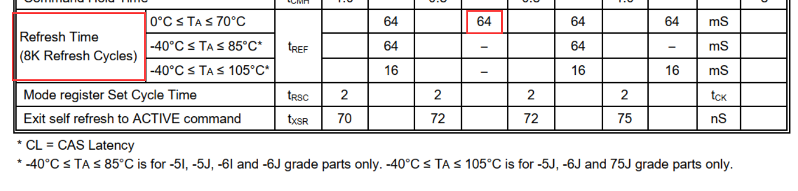

进行到这一步，已经可以像使用内部 SRAM 一样使用 SDRAM 了。   

将第 4 步的代码整理如下：

```c
#include "w9825g6kh.h"

static FMC_SDRAM_CommandTypeDef Command;

/** @defgroup W9825G6KH_Exported_Functions W9825G6KH Exported Functions
  * @{
  */
/**
  * @brief  Initializes the W9825G6KH SDRAm memory
  * @param  hsdram: Component object pointer
  * @param  target : FMC_SDRAM_CMD_TARGET_BANK1 or FMC_SDRAM_CMD_TARGET_BANK2 or FMC_SDRAM_CMD_TARGET_BANK1_2
  * @retval error status
  */
int w9825g6kh_init_sequence(SDRAM_HandleTypeDef *hsdram, uint32_t target)
{
	uint32_t tmpmode = 0;

    /* Step 1: Configure a clock configuration enable command */
    if(w9825g6kh_enable_clock(hsdram, target) != HAL_OK)		return -HAL_ERROR;
    
	/* Step 2: Insert 100 us minimum delay */
	/* Inserted delay is equal to 1 ms due to systick time base unit (ms) */
	(void)HAL_Delay(1);

	/* Step 3: Configure a PALL (precharge all) command */
	if(w9825g6kh_precharge_all(hsdram, target) != HAL_OK)	return -HAL_ERROR;
        
	/* Step 4: Configure a Refresh command */
	if(w9825g6kh_config_refresh_mode(hsdram, target, FMC_SDRAM_CMD_AUTOREFRESH_MODE) != HAL_OK)	return -HAL_ERROR;
            
	/* Step 5: Program the external memory mode register */
	tmpmode = (uint32_t)SDRAM_MODEREG_BURST_LENGTH_2 |
             SDRAM_MODEREG_BURST_TYPE_SEQUENTIAL   |
             SDRAM_MODEREG_CAS_LATENCY_2           |
             SDRAM_MODEREG_OPERATING_MODE_STANDARD |
             SDRAM_MODEREG_WRITEBURST_MODE_SINGLE;
	if(w9825g6kh_config_load_mode_reg(hsdram, target, tmpmode) != HAL_OK)	return -HAL_ERROR;

	/* Step 6: Set the refresh rate counter 
	 * SDRAM refresh period / Number of rows）*SDRAM时钟速度 – 20
	 *	  	= 64ms / 8192 *120MHz - 20
	 *  	= 917.5 取值918
	 */
	if(HAL_SDRAM_ProgramRefreshRate(hsdram, 918) != HAL_OK)	return -HAL_ERROR;

    return HAL_OK;
}

/**
  * @brief  Enable SDRAM clock
  * @param  Ctx Component object pointer
  * @param  target : FMC_SDRAM_CMD_TARGET_BANK1 or FMC_SDRAM_CMD_TARGET_BANK2 or FMC_SDRAM_CMD_TARGET_BANK1_2
  * @retval error status
  */
int w9825g6kh_enable_clock(SDRAM_HandleTypeDef *hsdram, uint32_t target)
{
    Command.CommandMode            = FMC_SDRAM_CMD_CLK_ENABLE;
    Command.CommandTarget          = target;
    Command.AutoRefreshNumber      = 1;
    Command.ModeRegisterDefinition = 0;

    /* Send the command */
    return -HAL_SDRAM_SendCommand(hsdram, &Command, W9825G6KH_TIMEOUT);
}

/**
  * @brief  Precharge all sdram banks
  * @param  hsdram: Component object pointer
  * @param  target : FMC_SDRAM_CMD_TARGET_BANK1 or FMC_SDRAM_CMD_TARGET_BANK2 or FMC_SDRAM_CMD_TARGET_BANK1_2
  * @retval error status
  */
int w9825g6kh_precharge_all(SDRAM_HandleTypeDef *hsdram, uint32_t target)
{
    Command.CommandMode            = FMC_SDRAM_CMD_PALL;
    Command.CommandTarget          = target;
    Command.AutoRefreshNumber      = 1;
    Command.ModeRegisterDefinition = 0;

    /* Send the command */
	return -HAL_SDRAM_SendCommand(hsdram, &Command, W9825G6KH_TIMEOUT);
}

/**
  * @brief  Program the external memory mode register
  * @param  hsdram: Component object pointer
  * @param  target : FMC_SDRAM_CMD_TARGET_BANK1 or FMC_SDRAM_CMD_TARGET_BANK2 or FMC_SDRAM_CMD_TARGET_BANK1_2
  * @param  mode : load mode register paras
  * @retval error status
  */
int w9825g6kh_config_load_mode_reg(SDRAM_HandleTypeDef *hsdram, uint32_t target, uint32_t mode)
{
    uint32_t tmpmrd;

    /* Program the external memory mode register */
    tmpmrd = mode;

    Command.CommandMode            = FMC_SDRAM_CMD_LOAD_MODE;
    Command.CommandTarget          = target;
    Command.AutoRefreshNumber      = 1;
    Command.ModeRegisterDefinition = tmpmrd;

    /* Send the command */
    return -HAL_SDRAM_SendCommand(hsdram, &Command, W9825G6KH_TIMEOUT);
}

/**
  * @brief  Configure Refresh mode
  * @param  hsdram: Component object pointer
  * @param  target : FMC_SDRAM_CMD_TARGET_BANK1 or FMC_SDRAM_CMD_TARGET_BANK2 or FMC_SDRAM_CMD_TARGET_BANK1_2
  * @param  refresh_mode: FMC_SDRAM_CMD_AUTOREFRESH_MODE or FMC_SDRAM_CMD_SELFREFRESH_MODE
  * @retval error status
  */
int w9825g6kh_config_refresh_mode(SDRAM_HandleTypeDef *hsdram, uint32_t target, uint32_t refresh_mode)
{
    Command.CommandMode            = refresh_mode;
    Command.CommandTarget          = target;
    Command.AutoRefreshNumber      = 8;
    Command.ModeRegisterDefinition = 0;

    /* Send the command */
	return -HAL_SDRAM_SendCommand(hsdram, &Command, W9825G6KH_TIMEOUT);
}


/**
  * @brief  Enter Power mode
  * @param  hsdram: Component object pointer
  * @param  target : FMC_SDRAM_CMD_TARGET_BANK1 or FMC_SDRAM_CMD_TARGET_BANK2 or FMC_SDRAM_CMD_TARGET_BANK1_2
  * @retval error status
  */
int w9825g6kh_enter_power_mode(SDRAM_HandleTypeDef *hsdram, uint32_t target)
{
    Command.CommandMode            = FMC_SDRAM_CMD_POWERDOWN_MODE;
    Command.CommandTarget          = target;
    Command.AutoRefreshNumber      = 1;
    Command.ModeRegisterDefinition = 0;

    /* Send the command */
	return -HAL_SDRAM_SendCommand(hsdram, &Command, W9825G6KH_TIMEOUT);
}

/**
  * @brief  Exit Power mode
  * @param  hsdram: Component object pointer
  * @param  target : FMC_SDRAM_CMD_TARGET_BANK1 or FMC_SDRAM_CMD_TARGET_BANK2 or FMC_SDRAM_CMD_TARGET_BANK1_2
  * @retval error status
  */
int w9825g6kh_exit_power_mode(SDRAM_HandleTypeDef *hsdram, uint32_t target)
{
    Command.CommandMode            = FMC_SDRAM_CMD_NORMAL_MODE;
    Command.CommandTarget          = target;
    Command.AutoRefreshNumber      = 1;
    Command.ModeRegisterDefinition = 0;

    /* Send the command */
	return -HAL_SDRAM_SendCommand(hsdram, &Command, W9825G6KH_TIMEOUT);
}

//uint32_t w9825g6kh_wr_test(void)
//{
//	uint32_t i;
//	uint32_t *pBuf;
//	uint32_t err = 0;
//	
////	/* 写SDRAM */
////	pBuf = (uint32_t *)(W9825G6KH_ADDR);
////	for (i = 0; i < W9825G6KH_SIZE / 4; i++)
////	{
////		pBuf[i] = i;
////	}
////	
////	/* 读SDRAM */
////	pBuf = (uint32_t *)(W9825G6KH_ADDR);
////	for (i = 0; i < W9825G6KH_SIZE / 4; i++)
////	{
////		if(pBuf[i] != i)	err++;
////	}
////	
////	if (err >  0)	return (4 * err);
//	
//	
//	
//	/* 测试按字节方式访问, 目的是验证 FMC_NBL0、FMC_NBL1 口线 */
//	uint8_t *pBytes = (uint8_t *)W9825G6KH_ADDR;
//	for (i = 0; i < 256; i++)
//    {
//        *pBytes++ = i;
//    }
//	
//	/* 比较SDRAM的数据 */
//	for (i = 0; i < 256; i++)
//	{
//		printf("%04d ", *pBytes);
//		if((i + 1) % 8 == 0)	printf("\r\n");
//        if (*pBytes++ != i)	err++;
//	}
//	
//	if (err >  0)	return err;
//		
//	return 0;
//}

uint32_t w9825g6kh_wr_test(void)
{
    int i = 0;
	char data_width = 4;
	uint32_t data_32 = 0;
	uint16_t data_16 = 0;
	uint8_t data_8 = 0;
	uint32_t err = 0;
	
	for (i = 0; i < W9825G6KH_SIZE / data_width; i++)
    {
		*(__IO uint32_t *)(W9825G6KH_ADDR + i * data_width) = (uint32_t)0x55AA55AA;
	}
	
    for (i = 0; i < W9825G6KH_SIZE / data_width; i++)
    {
        data_32 = *(__IO uint32_t *)(W9825G6KH_ADDR + i * data_width);
        if (data_32 != 0x55AA55AA)
		{
			err++;
		}
	}
	
	if(err > 0)	
	{
		printf("sdram test 32bit failed.\r\n");
		return err;
	}
	printf("sdram test 32bit success.\r\n");
	
	data_width = 2;
	for (i = 0; i < W9825G6KH_SIZE / data_width; i++)
    {
		*(__IO uint16_t *)(W9825G6KH_ADDR + i * data_width) = (uint16_t)0x55AA;
	}
	
    for (i = 0; i < W9825G6KH_SIZE / data_width; i++)
    {
        data_16 = *(__IO uint16_t *)(W9825G6KH_ADDR + i * data_width);
        if (data_16 != 0x55AA)
		{
			err++;
		}
	}
	
	if(err > 0)	
	{
		printf("sdram test 16bit failed.\r\n");
		return err;
	}
	printf("sdram test 16bit success.\r\n");
	
	data_width = 1;
	for (i = 0; i < W9825G6KH_SIZE / data_width; i++)
    {
		*(__IO uint8_t *)(W9825G6KH_ADDR + i * data_width) = (uint8_t)0x5A;
	}
	
    for (i = 0; i < W9825G6KH_SIZE / data_width; i++)
    {
        data_8 = *(__IO uint8_t *)(W9825G6KH_ADDR + i * data_width);
        if (data_8 != 0x5A)
		{
			err++;
		}
	}
	
	if(err > 0)	
	{
		printf("sdram test 8bit failed.\r\n");
		return err;
	}
	printf("sdram test 8bit success.\r\n");
	
	return err;
}
```

# 5 注意事项

1. SDRAM 时钟源选择。应该选择 HCLK3 为时钟源，因为跳转到 App 后复位，时钟源会重置为默认的 HCLK3，因此 BootLoader 内配置的 SDRAM 时钟源应该选择为 HCLK3。
2. 不建议在 APP 中使用 `HAL_RCC_DeInit();` 来复位 RCC，这会修改 FMC 的频率，影响对 SDRAM 的使用。
3. 在 BootLoader 中，配置了 FMC，在 App 中，需要注释以下这段代码：

```c
  /*
   * Disable the FMC bank1 (enabled after reset).
   * This, prevents CPU speculation access on this bank which blocks the use of FMC during
   * 24us. During this time the others FMC master (such as LTDC) cannot use it!
   */
//  FMC_Bank1_R->BTCR[0] = 0x000030D2;
```

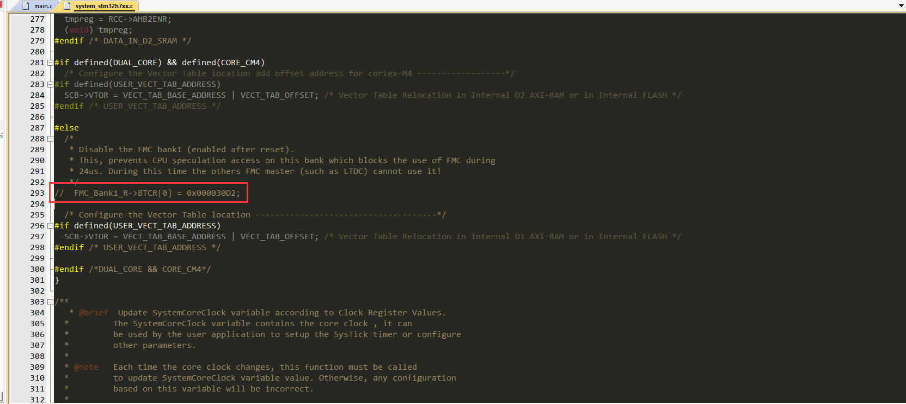

# 6 MPU配置

TEX = 1, C = 1, B = 1, S = 0, Memory Type 为 Write Back。

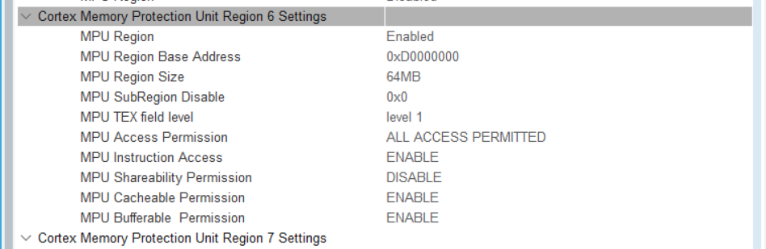

# 7  Reference

1. [26. FMC—扩展外部SDRAM — [野火\]STM32库开发实战指南——基于野火挑战者开发板 文档 (embedfire.com)](https://doc.embedfire.com/mcu/stm32/f429tiaozhanzhe/std/zh/latest/book/FMC.html#id1)
2. 安富莱\_STM32-V7开发板_用户手册，含BSP驱动包设计（V3.5）
3. [svcguy/stm32-w9825g6kh (github.com)](https://github.com/svcguy/stm32-w9825g6kh)
4. [Budali11/stm32h7-bootloader-application: 在stm32h750上使用bootloader+Application开发 (github.com)](https://github.com/Budali11/stm32h7-bootloader-application)
5. [【STM32】HAL库 STM32CubeMX教程十五---FMC-SDRAM(一)_fmc_nbl0_Z小旋的博客-CSDN博客](https://blog.csdn.net/as480133937/article/details/123455833)