# 0 前置知识

NOR Flash：允许随机存取存储器上的任何区域，以编码应用为主，其功能多与运算相关；

Nand Flash：主要功能是存储资料，适合储存卡之类的大量数据的存储。

Nand Flash 挂载在 FMC 的 **Bank3** 下，映射地址为 **0x80000000**，此处使用的是单颗 **W29N01GVSIAA**。

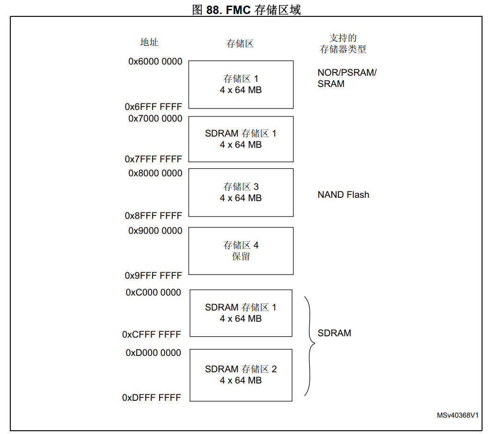

一个 Nand Flash 由多个 Plane 组成，一个 Plane 由 多个 Block 组成，一个 Block 又由多个 Page 组成，下图为 W29N01GVSIAA 的内存阵列组成，包含 1 个 Plane(Device)，1 个 Plane 包含 1024 个 Blocks，1 个 Blocks 包含 64 个 Pages，1 个 Pages 包含 2048 Bytes 的数据空间和 64 Bytes 的 Spare space。

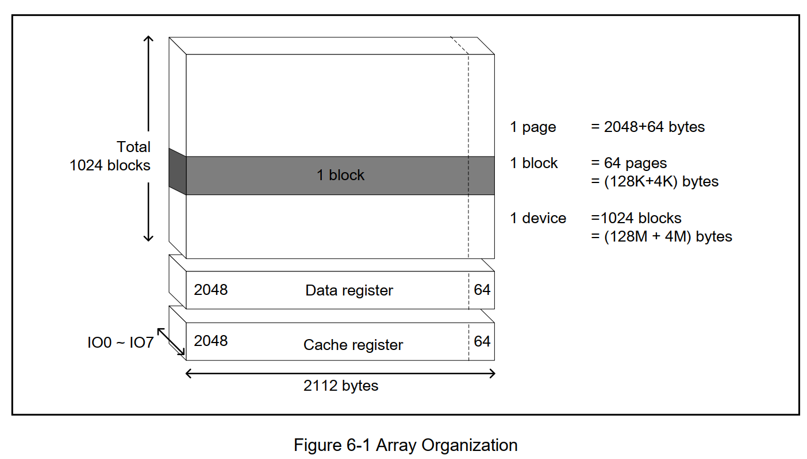

> 注：一个 Nand Flash 可以包含多个 Planes。

# 1 引脚配置

默认的 IO 配置未必与实际设计一直，需要自行设置，此处按下表设置。

| 对应接口  | IO   |
| --------- | ---- |
| FMC_D0    | PD14 |
| FMC_D1    | PD15 |
| FMC_D2    | PD0  |
| FMC_D3    | PD1  |
| FMC_D4    | PE7  |
| FMC_D5    | PE8  |
| FMC_D6    | PE9  |
| FMC_D7    | PE10 |
| FMC_ALE   | PD12 |
| FMC_CLE   | PD11 |
| FMC_NCE   | PG9  |
| FMC_NOE   | PD4  |
| FMC_NWAIT | PD6  |
| FMC_NWE   | PD5  |

对应的 W29N01GVSIAA 引脚配置如下：

| PIN NAME | I/O    | FUNCTION                                    |
| -------- | ------ | ------------------------------------------- |
| #WP      | I      | Write Protect                               |
| ALE      | I      | Address Latch Enable                        |
| #CE      | I      | Chip Enable                                 |
| #WE      | I      | Write Enable                                |
| RY/#BY   | O      | Ready/Busy                                  |
| #RE      | I      | Read Enable                                 |
| CLE      | I      | Command Latch Enable                        |
| I/O[0-7] | I/O    | Data Input/Output (x8)                      |
| Vcc      | Supply | Power supply                                |
| Vss      | Supply | Ground                                      |
| DNU      | -      | Do Not Use: This pins are unconnected pins. |
| N.C      | -      | No Connect                                  |

# 2 时钟配置

此处最好选择 **HCLK3** ，否则在 Bootloader 初始化 FMC ，App 直接使用的应用中，可能会导致程序卡死。

# 3 参数配置

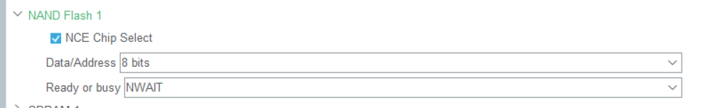

1. **NCE Chip Select**：片选使能；
2. **Data/Address**：8 位数据/地址总线；
3. **Ready or busy**：NWAIT 引脚检检测操作是否完成。

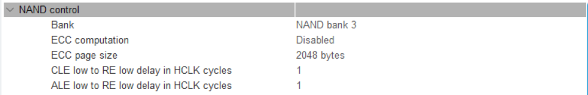

**NAND control**，HCLK cycle 为 $\frac{1}{240MHz}  = \frac{25}{6} ns $：

1. **Bank**：默认为 bank 3；
2. **ECC computation**：默认关闭 ECC 校验；
3. **ECC page size**：选 Page 大小，2048 Bytes；
4. **CLE low to RE low delay in HCLK cycles**：为 10 ns，参数为 1；
5. **ALE low to RE low delay in HCLK cycles**：为 10 ns，参数为 1。

> 注：TAR 和 TCLR 的参数计算方法如下图所示，SET 的参数大小在后文中介绍，此处两个参数**至少**需要取 1。

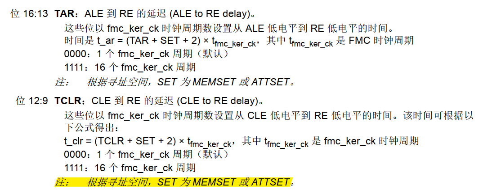

**NAND common/attribute space timing in HCLK cycles**：

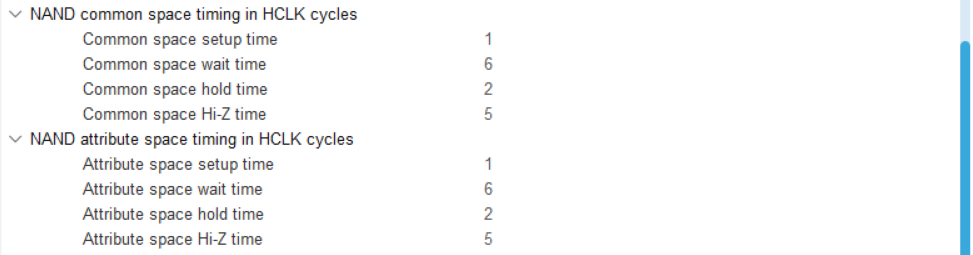

**配置 STM32CubeMX 之前需要先把 MEMXSET(Common space setup time)、MEMXWAIT(Common space wait time)、MEMXHOLD(Common space hold time) 和 MEMXHIZ(Common space Hi-Z time) 算出来。**可以参考 \0.Reference\4.NandFlash\an4761-using-stm32l476486-fsmc-peripheral-to-drive-external-memories--stmicroelectronics.pdf。

得到时序计算不等式：

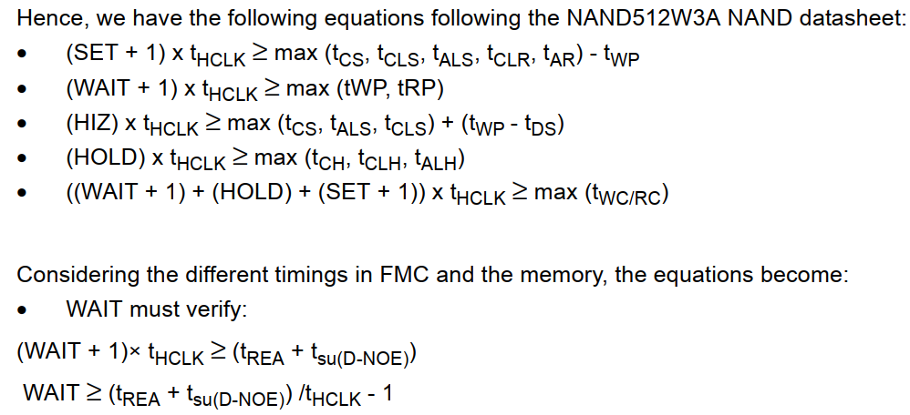

其中，$t_{su\left ( D-NOE \right ) } $在对应芯片的数据手册中定义，在 STM32H50XB 的数据手册中，该参数定义为 8ns。

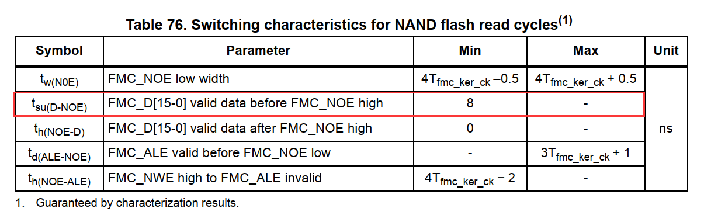

W29N01GVSIAA 的时序参数如下：

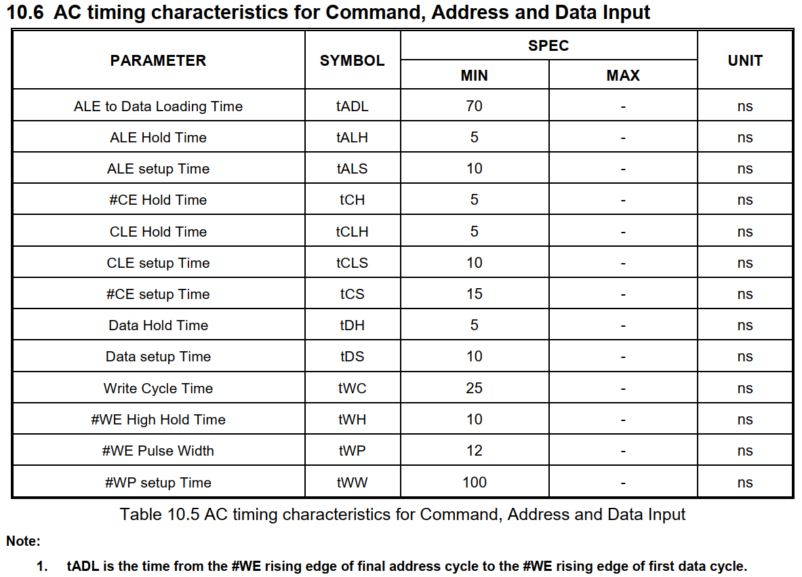

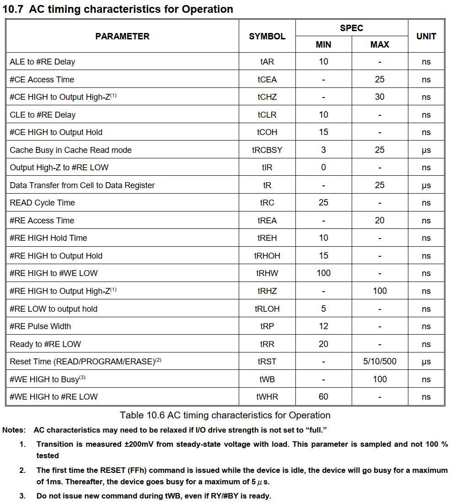

因此，可以计算得到，$MEMXSET\ge 1$，$MEMXWAIT \ge 6$，$MEMXHOLD \ge 2$，$MEMXHIZ \ge 5$。

以下参数的计算公式与上述类似：

Attribute space setup time = MEMXSET = 1 tHCLK

Attribute space wait time = MEMXWAIT =6 tHCLK

Attribute space hold time = MEMXHOLD  = 2 tHCLK

Attribute space Hi-Z time = MEMXHIZ =5 tHCLK

**NAND characteristic information**：

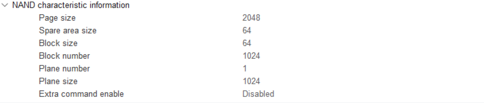

这些参数在上文中有定义，W29N01GVSIAA 包含 1 个 Plane(Device)，1 个 Plane 包含 1024 个 Blocks，1 个 Blocks 包含 64 个 Pages，1 个 Pages 包含 2048 Bytes 的数据空间和 64 Bytes 的 Spare space，不支持额外的命令。

# 4 MPU 配置

TEX = 0, C = 0, B = 1, S = 0, Memory Type 为 Device，需要注意不支持非对齐字节访问。

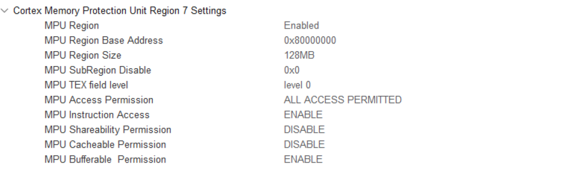

# 5 Reference

[RT-Thread-nandflash驱动关键配置参数说明RT-Thread问答社区 - RT-Thread](https://club.rt-thread.org/ask/article/0d1fbf638d393765.html)

[STM32CbueMX之NAND FLASH_stm32 nand flash_sudaroot的博客-CSDN博客](https://blog.csdn.net/sudaroot/article/details/99640553)