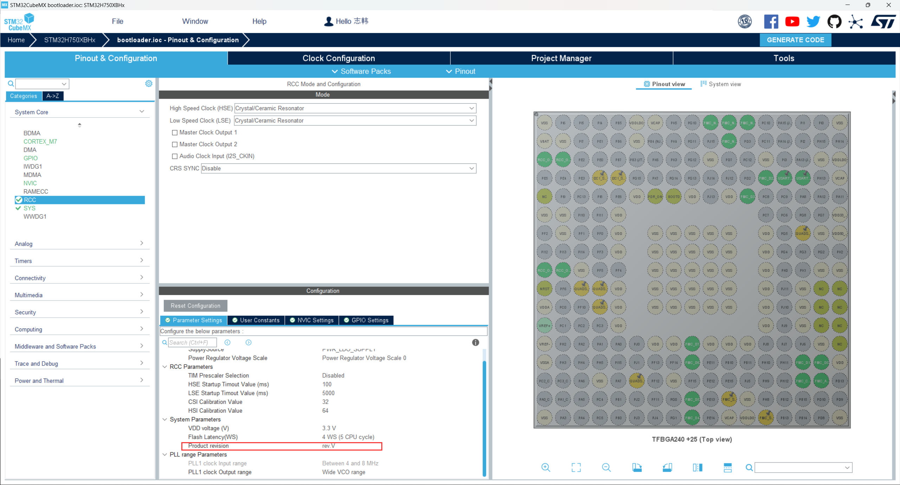
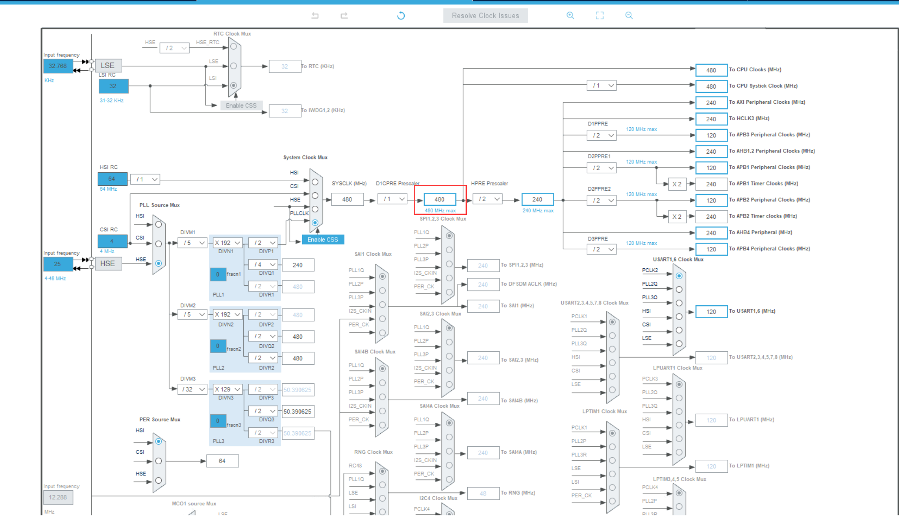

# stm32h750_config

STM32H750分为 Y 版和 V 版，两个版本之间的主要区别可以参考 Reference/dm00609692-migration-from-revy-to-revv-for-stm32h743753-and-stm32h750-value-line。目前市面上的芯片和开发板主要是基于 V 版设计的，此处基于 V 版介绍。

在 STM32CubeMX 中，STM32H7 V 版和 Y 版的主要区别，主要在以下两处：

1. Product revision 中，可以选择芯片的版本，默认是 Y 版，要记住修改；

> 注：此参数修改，会影响 Power Regulator Voltage Scale 和 Flash Latency(WS) 等参数，默认即可。

2. V 版芯片的主频最高为480 MHz，而 Y 版芯片的主频最高是 400 MHz。

STM32H750基础外设的配置参考手册，配置内容如下：

- [x] MPU
- [x] QuadSPI
- [x] FMC-SDRAM
- [x] FMC-NandFlash
- [ ] SD-MMC
- [ ] 

